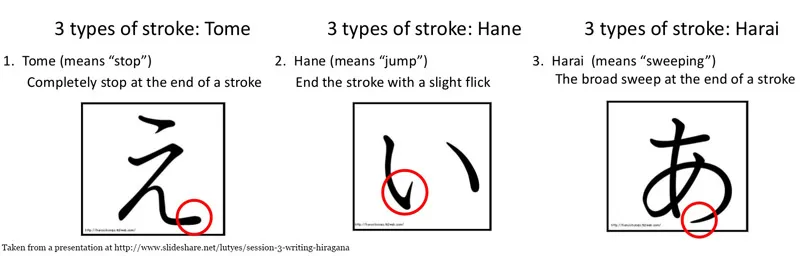
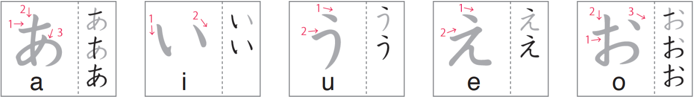

# Hiragana あいうえお

Day 5 - February 23, 2024

## Introduction

Welcome to the Hiragana lesson! Once we finish book 1, you'll be able to know all of the hiragana below!

1. あ (a) い (i) う (u) え (e) お  (o)
2. か (ka) き (ki) く (ku) け (ke) こ  (ko)
3. が (ga) ぎ (gi) ぐ (gu) げ (ge) ご (go)
4. さ (sa) し (shi) す (su) せ (se) そ (so)
5. ざ (za) じ (ji) ず (zu) ぜ (ze) ぞ (zo)
6. た (ta) ち (chi) つ (tsu) て (te) と (to)
7. だ (da) ぢ (ji) づ (zu) で (de) ど (do)
8. な (na) に (ni) ぬ (nu) ね (ne) の (no)
9. は (ha) ひ (hi) ふ (fu) へ (he) ほ (ho)
10. ば (ba) び (bi) ぶ (bu) べ (be) ぼ (bo)
11. ぱ (pa) ぴ (pi) ぷ (pu) ぺ (pe) ぽ (po)
12. ま (ma) み (mi) む (mu) め (me) も (mo)
13. や (ya) ゆ (yu) よ (yo)
14. ら (ra) り (ri) る (ru) れ (re) ろ (ro)
15. わ (wa) を (wo)
16. ん (n)

## Some history

**Hiragana** was created by a Buddhist monk around 774-853 AD and at that time hiragana was primarily used by women because it was believed that women were not allowed to learn the intricacy of Kanji.

**Katakana** was created using portions of Kanji while the more rounded hiragana was created by simplifying kanji.

**Kanji** has over 10K characters and in 1981, the Japanese Ministry of Education announced 1945 commonly used kanji called the **Joyou Kanji**. By the 6th grade, students already know half of it. Since then, the Joyou Kanji has been expanded.

## Writing Basics

### What is a stroke?

A stroke begins when the pen comes in contact with the paper and ends when it leaves from the paper.

### Why are brushed used to write?

Brushed are used to write Japanese because it bests represent how the characters should be written.

### Types of strokes

There are 3 types of strokes:

1. **`Tome`** (means "stop"): stop at the end of a stroke.
2. **`Hane`** (means "jump" or "bounce fade"): end the stroke with a slight flick.
3. **`Harai`** (means "sweep" or "fade out"): end the stroke by gradually diminishing the line to a point.

## Hiragana: あいうえお

The image below shows the correct stroke ordering of your first 5 hiragana characters!

(Image credit: NHK world)

## Writing Styles

There are two types of writing styles: **Left-to-right** and **top-to-bottom**.

Prior to World War 2, Japanese publications were written with the top-to-bottom style. Now, in modern Japan, both styles are used and acceptable therefore it's up to one's preference which one to use.

## Words

1. `いmoうto`: _younger sister_
2. `うsagi`: _rabbit_
3. `いsu`: _chair_
4. `kaう`: _to buy_
5. `えnpitsu`: _pencil_
6. `おmoshiroい`: _interesting_
7. `おkiru`: _wake up_
8. `え`: _a painting_
9. `いい`: _good_
10. `おい`: _nephew_
11. `あい`: _love_
12. `えい`: _a ray fish_
13. `おおい`: _many_
14. `あう`: _to meet_
15. `うえ`: _up_
16. `いう`: _to say_
17. `あお`: _blue_
18. `あkachan`: _baby_
19. `いnu`: _dog_
20. `うshi`: _cow_
21. `kaえru`: _frog_
22. `おkoru`: _to get mad_
23. `うchuう`: _space_
