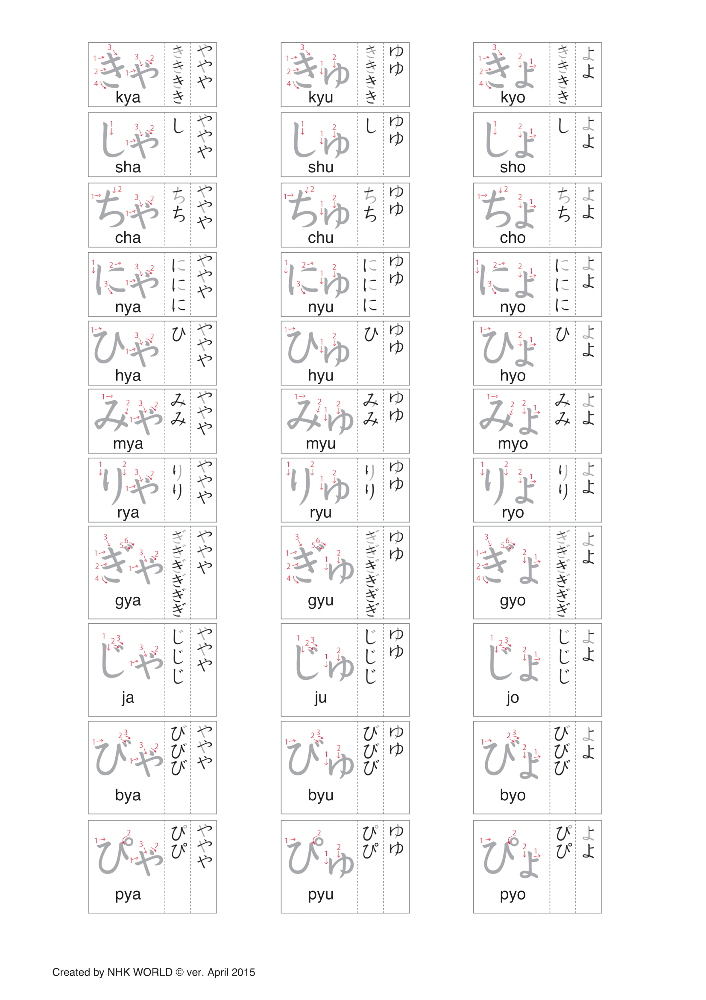

# Compound Hiragana

Day 23- March 12, 2024

## 1 | Introduction どうにゅう

The final hiragana lesson! Hooray! In this lesson, we will learn about compound hiragana and there are 33 of them but don't let that number scare you since they're hiragana you've already learned!

Examples

1. き (ki) + や (ya) = **きゃ (kya)**
2. し (shi) + ゆ (yu) = **しゅ (shu)**
3. ち (chi) + よ (yo) = **ちょ (cho)**

## 2 | Compound Hiragana

**Compound hiragana** are the hiragana which start with the **consonants + や/ゆ/よ**.

## 3 | Write Way of Writing Compound Hiragana

Make sure that the second character, namely や/ゆ/よ, is **visibly smaller** than the first character.

Examples

1. ~~みや~~ **みゃ** (mya)
2. ~~りよ~~ **りょ** (ryo)
3. ~~ぴや~~ **ぴゃ** (pya)

## 4 | Vocabulary ごい

Since all hiragana have been learned, the kana bullet point will now be removed.

1. **右**

- Progressive: _**みぎ**_
- English: _**right**_

2. **左**

- Progressive: _**ひだり**_
- English: _**left**_

3. **上**

- Progressive: _**うえ**_
- English: _**up**_

4. **下**

- Progressive: _**した**_
- English: _**down**_

5. **北**

- Progressive: _**きた**_
- English: _**north**_

6. **東**

- Progressive: _**ひがし**_
- English: _**east**_

7. **南**

- Progressive: _**みなみ**_
- English: _**south**_

8. **西**

- Progressive: _**にし**_
- English: _**west**_

9. **傘**

- Progressive: _**かさ**_
- English: _**umbrella**_

10. **家**

- Progressive: _**いえ**_
- English: _**house**_

11. **電話**

- Progressive: _**でんわ**_
- English: _**telephone**_

12. **鍵**

- Progressive: _**かぎ**_
- English: _**key**_

13. **椅子**

- Progressive: _**いす**_
- English: _**chair**_

14. **ごみ箱**

- Progressive: _**ごみばこ**_
- English: _**trash can**_

15. **トイレ**

- Progressive: _**toire**_
- English: _**toilet**_

16. **天ぷら**

- Progressive: _**てんぷら**_
- English: _**deep-fried vegetable or seafood**_

17. **豚カツ**

- Progressive: _**とんかつ**_
- English: _**pork cutlet**_

18. **アイスティー**

- Progressive: _**aisu ti-**_
- English: _**iced tea**_

## 5 | Phrases かいわ

1. **何がよろしいですか。**

- Progressive: _**なにがよろしいですか。**_
- English: _**What would you like?**_

2. **かしこまりました。**

- Progressive: _**かしこまりました。**_
- English: _**Certainly. / Very well.**_

## 6 | Words ことば

1. **とうちゃく**

- English: _**arrival**_

2. **としょかん**

- English: _**library**_

3. **ぎゅうにゅう**

- English: _**cow's milk**_

4. **さんみゃく**

- English: _**mountain range**_

5. **しょうばい**

- English: _**business, commerce**_

6. **じゅうたん**

- English: _**carpet**_

7. **でんぴょう**

- English: _**sales slip, voucher**_

8. **きょうだい**

- English: _**siblings**_

9. **りゅうがく**

- English: _**study abroad**_

10. **ぎゅうどん**

- English: _**beef bowl**_

11. **ちょう**

- English: _**butterfly**_

12. **びょうき**

- English: _**sick**_

13. **りゅう**

- English: _**dragon**_

14. **ぎゃく**

- English: _**reverse**_

15. **みょうじ**

- English: _**last name**_

16. **しゅうり**

- English: _**repair**_

17. **きょく**

- English: _**a song**_

18. **かいしゃ**

- English: _**company**_

19. **でんしゃ**

- English: _**train**_

20. **きんぎょ**

- English: _**gold fish**_

21. **ちきゅうぎ**

- English: _**globe**_

22. **しゅう**

- English: _**state**_

23. **べんきょう**

- English: _**study**_

24. **ちゅうしゃ**

- English: _**shot, injection (syringe)**_

25. **おきゃくさん**

- English: _**a customer or guest**_

26. **しゅじゅつ**

- English: _**surgery**_

27. **じょうだん**

- English: _**a joke**_

28. **かいじゅう**

- English: _**a monster**_

29. **はっぴょう**

- English: _**an announcement**_
