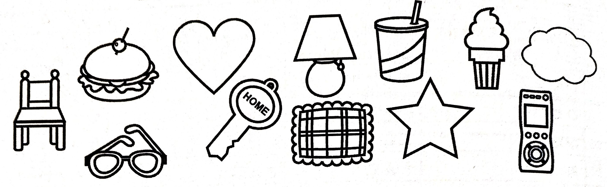
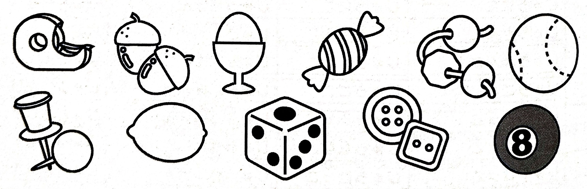
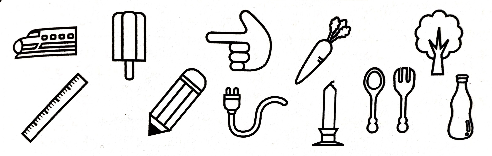
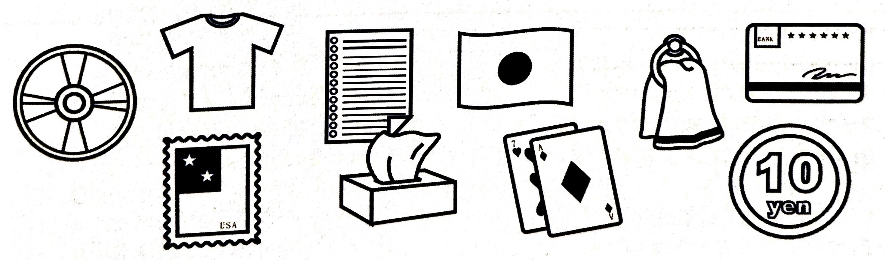
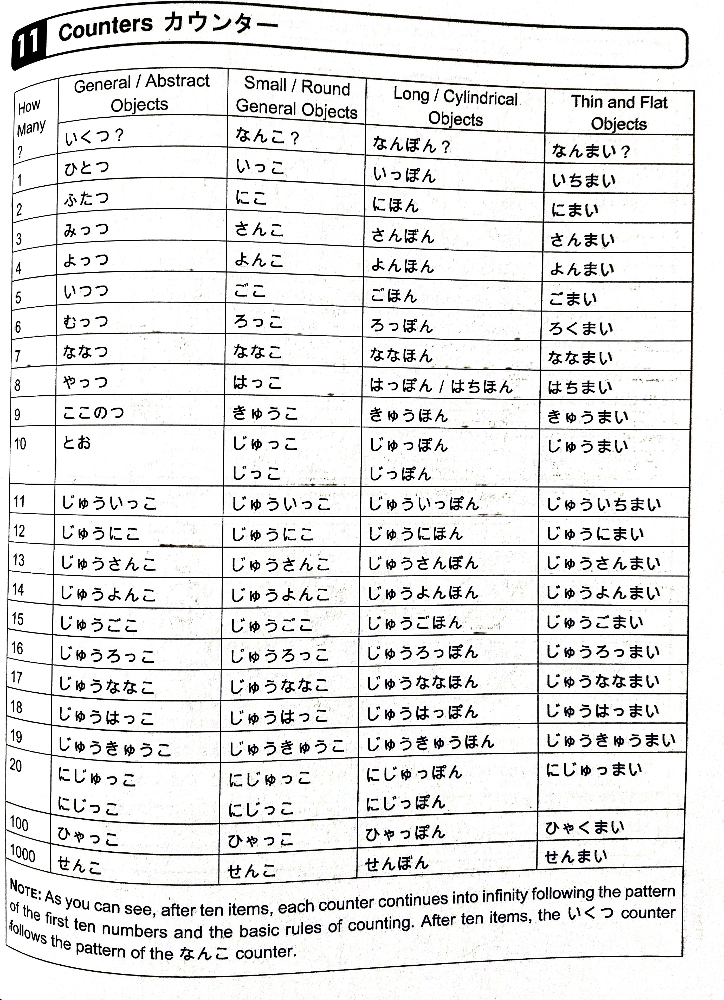

# Lesson 11 - Counting Objects

Day 24 - March 13, 2024

## 1 | About This Lesson このレッスンについて

Learn how to count various objects depending on their characteristics.

## 2 | Explanation せつめい

Many people say that counting in Japanese is not quite the same in English since things in Japanese are counted differently based on their shape or classification. However, if you think about it, English **does** have a similar system, for example, _"one **slice** of pizza"_, _"a **school** of fish"_, _"a **flock** of birds"_, etc.

In this lesson, four of the most common counters in Japanese will be taught. (Meaning of course that there are other more counters but they will be taught in subsequent lessons.)

## 3 | Counters カウンター

### 3.1 | The general or abstract objects counter: いくつ

The **いくつ** counter, a.k.a. **～つ** counter, is the most common and versatile counter. It can be used to count any physical object as well as any abstract objects (e.g. _"one idea"_, _"two problems"_, etc.). It **cannot** be used to count living beings like people or animals. And it is also **not** typical used with bigger objects such as an airplane.

> It's really ～つ counter because いくつ is used when you're asking _"How many?"_.

Many Japanese people use this counter even though there's a more appropriate counter. Always strive to use the correct counter but when in doubt then use the いくつ counter.

Below shows the word counter for each number.

1. **ひとつ**
2. **ふたつ**
3. **みっつ**
4. **よっつ**
5. **いつつ**
6. **むっつ**
7. **ななつ**
8. **やっつ**
9. **ここのつ**
10. **とお**

For numbers above 10, the いくつ counter follows the なんこ counter pattern.

### 3.2 | The other general counter or the round/small objects counter: なんこ

The **なんこ** counter, a.k.a. **～こ** counter, is another general counter second to いくつ. It is mostly used for counting round objects or small objects such as fruits, balls, dice, thumbtacks, etc. Also the object doesn't have to be perfectly round to use this counter.

なんこ **cannot** be used to count abstract objects unlike いくつ.

Below shows the word counter for each number.

1. **いっこ**
2. **にこ**
3. **さんこ**
4. **よんこ**
5. **ごこ**
6. **ろっこ**
7. **ななこ**
8. **はっこ**
9. **きゅうこ**
10. **じゅっこ** / **じっこ**
11. **じゅういっこ**
12. **じゅうにこ**
13. **じゅうさんこ**
14. **じゅうよんこ**
15. **じゅうごこ**
16. **じゅうろっこ**
17. **じゅうななこ**
18. **じゅうはっこ**
19. **じゅうきゅうこ**
20. **にじゅっこ** / **にじっこ**

> Notice that from eleven and above, the pattern follows of that with the basic counting (じゅう, にじゅう, さんじゅう, etc.) plus the first ten numbers. Also, the なんこ counter for eleven and above are used for the いくつ counter.

For one hundred.

100. **ひゃっこ**

And for the one thousand.

1000. **せんこ**

> I'm not sure what is for the 10K counter since looking it up... Simply put, まんこ can mean 10K but can also mean something else _degenerate_.

### 3.3 | The long objects or cylindrical objects counter: なんぼん

The **なんぼん** counter, a.k.a. **～ぼん** counter, is used to count objects that are either long or cylindrical (or both!). Examples are bottles of cola, pens, legs, and even flowers (due to their stems). It can also be used to count objects that aren't seemingly long or cylindrical like video cassettes (because if you make it stand, they're long), teeth, etc.

Don't be surprised if you hear this counter used in a variety of situations.

Below shows the word counter for each number.

1. **いっぽん**
2. **にほん**
3. **さんぼん**
4. **よんほん**
5. **ごほん**
6. **ろっぽん**
7. **ななほん**
8. **はっぽん** / **はちほん**
9. **きゅうほん**
10. **じゅっぽん** / **じっぽん**

> Notice that the なんぼん counter is pretty irregular. **Pay attention** to the words above if it is using ほ, ぼ, or ぽ.

11. **じゅういっぽん**
12. **じゅうにほん**
13. **じゅうさんぼん**
14. **じゅうよんほん**
15. **じゅうごほん**
16. **じゅうろっぽん**
17. **じゅうななほん**
18. **じゅうはっぽん**
19. **じゅうきゅうほん**
20. **にじゅっぽん** / **にじっぽん**

> For eleven and above, the same pattern like before: the basic counting plus the first 10 numbers. (I'm not sure if you can say じゅうはちほん for 18.)

For one hundred.

100. **ひゃっぽん**

And for the one thousand.

1000. **せんぼん**

> Maybe the 10K will be taught later?

### 3.4 | The thin objects or flat objects counter: なんまい

The **なんまい** counter, a.k.a. **～まい** counter, is used to count objects that are either thin or flat (or both!). Examples are papers, tickets, plates, etc. However, it **cannot** be used to count books, magazines, etc. In their cases, the _published materials counter さつ_ is used (which will be taught in later lessons).

Below shows the word counter for each number.

1. **いちまい**
2. **にまい**
3. **さんまい**
4. **よんまい**
5. **ごまい**
6. **ろくまい**
7. **ななまい**
8. **はちまい**
9. **きゅうまい**
10. **じゅうまい**
11. **じゅういちまい**
12. **じゅうにまい**
13. **じゅうさんまい**
14. **じゅうよんまい**
15. **じゅうごまい**
16. **じゅうろくまい**
17. **じゅうななまい**
18. **じゅうはちまい**
19. **じゅうきゅうまい**
20. **にじゅうまい**

For one hundred.

100. **ひゃくまい**

And for the one thousand.

1000. **せんまい**

> Notice that the なんまい counter is pretty easy to remember since you just need basic counting + まい. Presumably, 10K might be まんまい.

### 3.5 | いくつ、なんこ、なんぼん、なんまい

Below is a picture of all the mentioned counters above in a single table.

> Note that the 16 and 18 in なんまい have typos.

## 4 | Grammar ぶんぽう

### 4.1 | The counters and particles

Particles are **not** necessary after the counters. If you remember last lesson, to ask for something you'd add the を particle after the object but if it is a counter then you don't put a particle.

Examples

1. **General / Abstract objects**

- ひとつ ください。 (One, please.)
- まくら を みっつ ください。 (Three pillows, please.)
- いす を いつつ ください。 (Five chairs, please.)

2. **Round / General objects**

- よんこ ください。 (Four, please.)
- りんご を にこ ください。 (Two apples, please.)
- Orenji を じゅうこ ください。 (Ten oranges, please.)

3. **Long / Cylindrical objects**

- ろっぽん ください。 (Six, please.)
- えんぴつ を いっぽん ください。 (One pencil, please.)
- Banana を ななほん ください。 (Seven bananas, please.)

4. **Thin / Flat objects**

- よんまい ください。 (Four, please.)
- Piza を にまい ください。 (Two slices of pizza, please.)
- かみ を ごひゃくまい ください。 (Five hundred pieces of paper, please.)

### 4.2 | あと

**あと** in English could mean _"more"_, _"else"_, _"in addition"_, or sometimes _"other"_. It is placed in front of numbered things. Also, the particle は can be added after it.

Examples

1.

- A: **あと** いくら ですか。 (How much **more** is it?)
- B: **あと** ごひゃくえん です。 (It's 500 yen **more**.)

2.

- A: **あと** は どこ の resutoran が おいしいですか。 (What **other** restaurant is delicious?)
- B: わたし の hoteru の resutoran が おいしいです。 (The restaurant in my hotel is delicious.)

3.

- A: なに が すきですか。 (What do you like?)
- B: すし と piza が すきです。 (I like sushi and pizza)
- A: **あと**、なに が すきですか。 (What **else** do you like?)
- B: **あと**は、さしみ が すきです。 (**In addition**, I like sashimi.)

4.

- A: **あと** は なに が いいですか。 (What **else** would you like?)
- B: みず と supu-n を ください。 (Some water and spoon, please.)
- A: はい、しょうしょう おまち ください。 (Please wait a few moments.)

## 5 | Sentences Examples

In this section, there will be more counter examples!

1. **Koppu は いくつ ですか。 (How many cups are there?)**

- Koppu は いつつ です。 (There are five cups.)
- ひとつ です。 (There is one.)

2. **Orenji は なんこ/いくつ ですか。** (How many oranges are there?)

- Orenji は ろっこ/むっつ です。 (There are six oranges.)
- みっつ/さんこ です。 (There are three.)

3. **えんぴつ は なんぼん ですか。 (How many pencils are there?)**

- えんぴつ は にほん です。 (There are two pencils.)
- えんぴつ は にじゅうにほん です。 (There are 22 pencils.)
- じゅっぽん です。 (There are ten.)

4. **Chiketto は なんまい ですか。 (How many tickets are there?)**

- Chiketto は ななまい です。 (There are seven tickets.)
- Chiketto は ひゃくまい です。 (There are 100 tickets.)
- じゅうにまい です。 (There are twelve.)

5. **Pinkuのはな は なんぼん ですか。 (How many pink flowers are there?)**

- Pinkuのはな は いっぽん です。 (There is one pink flower.)
- さんぼん です。 (There are three.)

6. **むらさきのほし は いくつ ですか。 (How many purple stars are there?)**

- むらさきのほし は さんじゅうきゅうこ です。 (There are 39 purple stars.)
- むらさきのほし は ななじゅっこ です。 (There are 70 purple stars.)

7. **なにがいいですか。 (What would you like?)**

- Piza を さんまい ください。 (Three slices of pizza please.)
- みず と banana を いっぽん ください。 (Some water and a banana please.)

8. **Karenda- は なんまい ですか。 (How many calendars are there?)**

- ななじゅういちまい です。 (There are 71.)
- ひゃくにじゅうごまい です。 (There are 125.)
- いちまんよんせんまい です。 (There are 14,000.)

9. **Ko-ra は なんぼん ですか。 (How many colas are there?)**

- はっぽん です。 (There are eight.)
- よんほん です。 (There are four.)

10. **Ko-ra は あと なんぼん ですか。 (How many more cans of cola?)**

- あと ろっぽん ください。 (Six more cans, please.)
- あと いっぽん ください。 (One more can, please.)

11. **あと は いくつ が いいですか。 (How many more would you like?)**

- あと ふたつ ください。 (Two more, please.)
- あと じゅうろっこ ください。 (Sixteen more, please.)

12. **Banana は なんぼん ですか。 (How many bananas are there?)**

- じゅうごほん です。 (There are 15.)
- たぶん ろっぽん です。 (Maybe there are six.)

13. **Piza は なんまい ほしいですか。 (How many pieces of pizza do you want?)**

- さんまい ほしいです。 (I want three.)
- Piza は ほしくないです。 (I don't want any pizza.)

## 6 | Conversations Examples

1. **Conversation at a ticket booth for a concert**

- **A**: Chiketto を よんまい ください。 (Four tickets, please.)
- **B**: はい。 (Okay.)
- **A**: あっ、あと にまい ください。 (Oh! Two more tickets, please.)
- **B**: はい。ななまい ですね。 (Okay. Seven, right?)
- **A**: いいえ、ちがいます。Chiketto を ろくまい ください。 (No, that's wrong. Six tickets, please.)

2. **Conversation at a drink stand**

- **A**: Ko-ra を ください。 (Please give me some cola.)
- **B**: なんぼん ですか。 (How many?)
- **A**: にほん ください。 (Two, please.)

## 7 | Summary ようやく

Okay, this is another big fat lesson. Hopefully you're still alive because I literally died. Anyways, let's review what we learned today, don't we?

In this lesson, we learned four of the most common counters in Japanese.

1. **いくつ**: Used for general objects or abstract objects
2. **なんこ**: Used for general objects as well, round objects, and small objects. **Cannot** be used for abstract objects.
3. **なんぼん**: Used for long objects or cylindrical objects.
4. **なんまい**: Used for thin objects or flat objects.

Then we also learned to say _"more"_, _"else"_, _"in addition"_, or sometimes _"other"_ with **あと**.

Finally, we saw a lot of examples on how to use these four counters.
