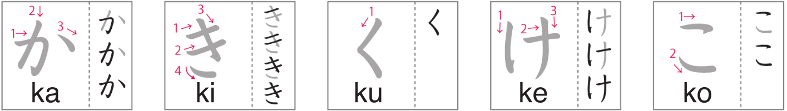

# Hiragana かきくけこがぎぐげご

Day 7 - February 25, 2024

## 1 | Introduction

Welcome to the second part of the hiragana lesson! In this lesson, we will be learning `か`, `き`, `く`, `け`, `こ`, `が`, `ぎ`, `ぐ`, `げ`, and `ご`. In other words, the `K` + vowels and `G` + vowels.

## 2 | Hiragana: かきくけこ

This is the second batch of your new hiragana: `か` (_"ka"_), `き` (_"ki"_), `く` (_"ku"_), `け` (_"ke"_), and `こ` (_"ko"_).

(Image credit: NHK world)

## 3 | Hiragana: がぎぐげご

Part of the second batch are these hiragana with the daくten: `が` (_"ga"_), `ぎ (_"gi"_)`, `ぐ` (_"gu"_), `げ` (_"ge"_), and `ご` (_"go"_).

(Image credit: NHK world)

## 4 | The daくten

As you've noticed, the only difference between `か`, `き`, `く`, `け`, `こ` and `が`, `ぎ`, `ぐ`, `げ`, `ご` are the two stokes up in the right hand corner. Those strokes are called **daくten**.

## 5 | Vocabulary

You'll see that the words/phrases here are already been discussed or part of the **Words** section but now that's under the **Vocabulary** section, that means... It's now **mandatory** to learn them.

1. **お母さん**

- Kana: _**おかあさん**_
- Progressive: _**おかあsan**_
- English: _**mother**_

2. **お父さん**

- Kana: _**おとうさん**_
- Progressive: _**おtoうsan**_
- English: _**father**_

3. **おじいさん**

- Kana: _**おじいさん**_
- Progressive: _**おjiいsan**_
- English: _**grandfather**_

> Interestingly, the kanji is usually written in kana but there is a kanji form which is **お祖父さん**.

4. **おばあさん**

- Kana: _**おばあさん**_
- Progressive: _**おbaあsan**_
- English: _**grandmother**_

> Same here as well, the kanji form is usually written in kana but there is a kanji form which is **お祖母さん**.

5. **赤ちゃん**

- Kana: _**あかちゃん**_
- Progressive: _**あかchan**_
- English: _**baby**_

6. **ありがとう**

- Kana: _**ありがとう**_
- Progressive: _**あriがtoう**_
- English: _**thank you, thanks**_

7. **おはようございます**

- Kana: _**おはようございます**_
- Progressive: _**おhayoうごzaいmasu**_
- English: _**good morning**_

8. **お休みなさい**

- Kana: _**おやすみなさい**_
- Progressive: _**おyasuminasaい**_
- English: _**good night**_

9. **今日は**

- Kana: _**こんにちは**_
- Progressive: _**こnnichiwa**_
- English: _**good afternoon**_

10. **さようなら**

- Kana: _**さようなら**_
- Progressive: _**sayoうnara**_
- English: _**good bye, farewell**_

## 6 | Words

1. **きく**

- English: _**to listen**_

2. **かminari**

- English: _**lightning**_

3. **くuぐn**

- English: _**air force**_

4. **こけ**

- English: _**moss**_

5. **けmushi**

- English: _**caterpillar**_

6. **くうこう**

- English: _**airport**_

7. **ぎnいro**

- English: _**silver color**_

8. **きnniく**

- English: _**muscle**_

9. **ごご**

- English: _**afternoon**_

10. **こおri**

- English: _**ice**_

11. **き**

- English: _**tree**_

12. **かく**

- English: _**to write**_

13. **いく**

- English: _**squid**_

14. **かぎ**

- English: _**key**_

15. **かい**

- English: _**shell**_

16. **がいこく**

- English: _**foreign country**_

17. **おおきい**

- English: _**big**_

18. **tsuき**

- English: _**moon**_

19. **けいtaいdenwa**

- English: _**cell phone**_

20. **choきnbaこ**

- English: _**safe, piggy bank**_

21. **suいか**

- English: _**watermelon**_
