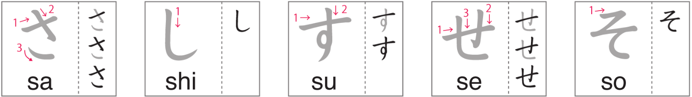
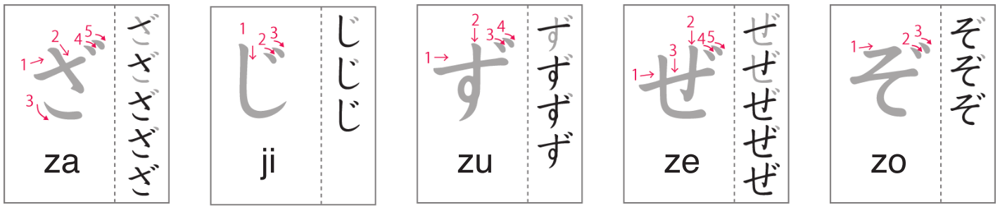

# Hiragana さしすせそざじずぜぞ

Day 9 - February 27, 2024

## 1 | Introduction どうにゅう

Welcome to the third hiragana lesson! Today we will be learning about `さ` _(sa)_, `し` _(shi)_, `す` _(su)_, `せ` _(se)_, `そ` _(so)_, `ざ` _(za)_, `じ` _(ji)_, `ず` _(zu)_, `ぜ` _(ze)_, and `ぞ` _(zo)_.

## 2 | Hiragana さしすせそ

Follow the strokes on the image below to learn the **s + vowels** hiragana.

(Image credit: NHK world)

Notice that し is **not** _"si"_ but _"shi"_.

## 3 | Hiragana ざじずぜぞ

Follow the strokes on the image below to learn the **z + vowels** hiragana.

(Image credit: NHK world)

Notice that じ is **not** _"zi"_ but _"ji"_.

## 4 | Vocabulary ごい

1. **犬**

- Kana: _**いぬ**_
- Progressive: _**いnu**_
- English: _**dog**_

2. **猫**

- Kana: _**ねこ**_
- Progressive: _**neこ**_
- English: _**cat**_

3. **象**

- Kana: _**ぞう**_
- Progressive: _**ぞう**_
- English: _**elephant**_

4. **馬**

- Kana: _**うま**_
- Progressive: _**うｍa**_
- English: _**horse**_

5. **兎**

- Kana: _**うさぎ**_
- Progressive: _**うさぎ**_
- English: _**rabbit**_

6. **パンダ**

- Kana: _**パンダ**_
- Progressive: _**panda**_
- English: _**panda**_

7. **鼠**

- Kana: _**ねずみ**_
- Progressive: _**neずmi**_
- English: _**mouse**_

8. **ライオン**

- Kana: _**ライオン**_
- Progressive: _**raいおn**_
- English: _**lion**_

9. **麒麟**

- Kana: _**きりん**_
- Progressive: _**きrin**_
- English: _**giraffe**_

10. **失**

- Kana: _**うし**_
- Progressive: _**うし**_
- English: _**cow**_

11. **猿**

- Kana: _**さる**_
- Progressive: _**さru**_
- English: _**monkey**_

12. **羊**

- Kana: _**ひつじ**_
- Progressive: _**hitsuじ**_
- English: _**sheep**_

13. **狐**

- Kana: _**きつね**_
- Progressive: _**きtsune**_
- English: _**fox**_

14. **熊**

- Kana: _**くま**_
- Progressive: _**くｍa**_
- English: _**bear**_

## 5 | Words ことば

1. **muraさき**

- English: _**purple**_

2. **しro**

- English: _**white**_

3. **あせ**

- English: _**sweat**_

4. **さす**

- English: _**to point**_

5. **そtsugyoう**

- English: _**graduation**_

6. **じかn**

- English: _**time**_

7. **あnぜn**

- English: _**safety**_

8. **げｎざi**

- English: _**currently, at present**_

9. **ひか**

- English: _**deer**_

10. **すずしい**

- English: _**cool**_

11. **おそい**

- English: _**slow/late**_

12. **すうじ**

- English: _**number**_

13. **せかい**

- English: _**world**_

14. **かず**

- English: _**numbers**_

15. **ずbon**

- English: _**pants**_

16. **しnbun**

- English: _**newspaper**_

17. **tsuくえ**

- English: _**desk**_

18. **さmuい**

- English: _**cold**_

19. **waくせい**

- English: _**planet**_

20. **おhiさしburideす。**

- English: _**It's been a long time. / Long time no see.**_

21. **____waげｎきdeすか。**

- English: _**Is ____ healthy / doing fine? (Are you fine?)**_

22. **げnきdeす。**

- English: _**They're fine. / I'm fine.**_

23. **kamera**

- English: _**camera**_

24. **shumi**

- English: _**hobby**_

25. **すごいdeすne。**

- English: _**That's great. / That's awesome.**_

26. **gorufu**

- English: _**golf**_
