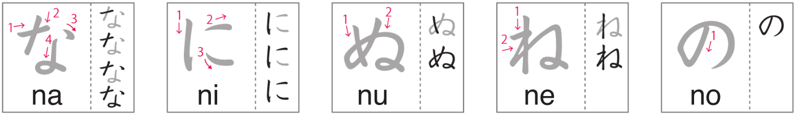

# Hiragana なにぬねの

Day 13 - March 2, 2024

## 1 | Introduction どうにゅう

The fifth batch to your way of learning hiragana! Today we will learn about **な** _(na)_, **に** _(ni)_, **ぬ** _(nu)_, **ね** _(ne)_, **の** _(no)_, .

## 2 | Hiragana なにぬねの

Follow the strokes on the image below to learn the **n + vowels** hiragana.

(Image credit: NHK world)

## 3 | Vocabulary ごい

1. **バスケットボール**

- Kana: _**booru**_
- Progressive: _**basuketto**_
- English: _**バスケットボール**_

2. **ギャンブル**

- Kana: _**ギャンブル**_
- Progressive: _**gyanburu**_
- English: _**gambling**_

3. **サッカー**

- Kana: _**サッカー**_
- Progressive: _**sakka-**_
- English: _**soccer**_

4. **苺**

- Kana: _**いちご**_
- Progressive: _**いちご**_
- English: _**strawberry**_

5. **みかん/オレンジ**

- Kana: _**みかん/オレンジ**_
- Progressive: _**miかn / orenji**_
- English: _**orange (fruit)**_

6. **りんご**

- Kana: _**りんご**_
- Progressive: _**rinご**_
- English: _**apple**_

7. **バナナ**

- Kana: _**バナナ**_
- Progressive: _**banana**_
- English: _**banana**_

8. **西瓜**

- Kana: _**すいか**_
- Progressive: _**すいか**_
- English: _**watermelon**_

9. **レモン**

- Kana: _**レモン**_
- Progressive: _**remon**_
- English: _**lemon**_

10. **桃**

- Kana: _**もも**_
- Progressive: _**momo**_
- English: _**peach**_

11. **ぶどう**

- Kana: _**ぶどう**_
- Progressive: _**buどう**_
- English: _**grapes**_

12. **映画**

- Kana: _**えいが**_
- Progressive: _**えいが**_
- English: _**movie**_

13. **俳優**

- Kana: _**はいゆう**_
- Progressive: _**はいyuう**_
- English: _**actor**_

14. **も**

- Kana: _**も**_
- Progressive: _**mo**_
- English: _**also, too (particle)**_

## 4 | Words ことば

1. **なつ**

- English: _**summer**_

2. **yoなか**

- English: _**middle of the night**_

3. **のmu**

- English: _**to drink**_

4. **ねru**

- English: _**to sleep, to go to bed**_

5. **ぬいぐrumi**

- English: _**stuffed animal**_

6. **にがい**

- English: _**bitter tasting**_

7. **ぬぐ**

- English: _**to take off clothes**_

8. **のru**

- English: _**to ride**_

9. **ながい**

- English: _**long**_

10. **にwaとri**

- English: _**chicken**_

11. **ぬru**

- English: _**to paint**_

12. **にし**

- English: _**west**_

13. **ねつ**

- English: _**fever**_

14. **ぬど**

- English: _**throat**_

15. **かに**

- English: _**crab**_

16. **にっき**

- English: _**diary**_

17. **にく**

- English: _**meat**_

18. **にじ**

- English: _**rainbow**_

19. **ねじ**

- English: _**a screw**_

20. **ねあげ**

- English: _**a rise in price**_

21. **かね**

- English: _**steel**_

22. **ねぎ**

- English: _**green onion**_

23. **なつかしい**

- English: _**dear, longed for**_
