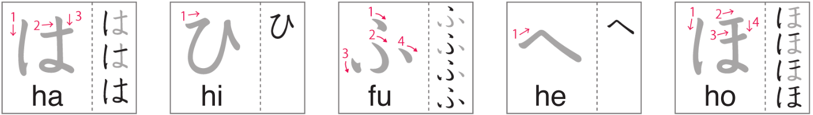
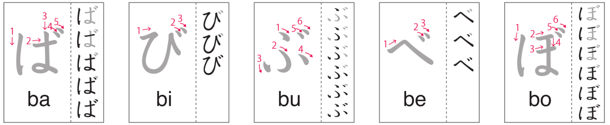
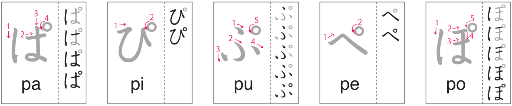

# Hiragana はひふへほばびぶべぼぱぴぷぺぽ

Day 15 - March 4, 2024

## 1 | Introduction どうにゅう

The sixth batch of hiragana for today! Which are: **は** _(ha)_, **ひ** _(hi)_, **ふ** _(fu)_, **へ** _(he)_, **ほ** _(ho)_, **ば** _(ba)_, **び** _(bi)_, **ぶ** _(bu)_, **べ** _(be)_, **ぼ** _(bo)_, **ぱ** _(pa)_, **ぴ** _(pi)_, **ぷ** _(pu)_, **ぺ** _(pe)_, and **ぽ** _(po)_.

## 2 | Hiragana はひふへほ

Follow the strokes on the image below to learn the **h + vowels** hiragana.

(Image credit: NHK world)

Notice ふ which is written with _FU_ and not _HU_ and why is that? Actually Japanese people will sometimes represent ふ as _HU_, however, the pronunciation of ふ is closer to _fu_ but should be voiced softer! It's like saying _hu_ and _fu_ at the same time if that makes sense.

## 3 | Hiragana ばびぶべぼ

Follow the strokes on the image below to learn the **b + vowels** hiragana.

(Image credit: NHK world)

## 4 | Hiragana ぱぴぷぺぽ

Follow the strokes on the image below to learn the **p + vowels** hiragana.

(Image credit: NHK world)

Notice the little circle above the _h + vowels_ hiragana where the _dakuten_ normally would go. (_dakuten_ is the two little lines like in ば)

That circle is the last stroke and is written clockwise. Most Japanese people refer to it as _maru_ which means _circle_ but its official name is _handakuten_.

## 5 | Special Usage

### 5.1 | The topic marker は (wa)

The topic marker identifies the subject of a sentence. It is written with は and never わ (wa). In all other cases, は is always read as _ha_ except of course as a topic marker.

Examples

1. _"あなた**は(wa)**だreですか。"_ -> _"Who are you?"_
2. _"Banana**は(wa)**きいroです。"_ -> _"Bananas are yellow."_

### 5.2 | The direction marker へ (e)

The direction marker is written with へ and pronounced _e_. It is never written with え. Like は, if it is not a direction marker then へ is pronounced as _he_. The direction marker is taught in Lesson 12.

Examples

1. _"がっこう**へ(e)**いきmaす。"_ -> _"I am going towards **(to)** school."_
2. _"とうkyoう**へ(e)**いきmaす。"_ -> _"I am going towards **(to)** Tokyo."_

> I didn't know Tokyo is spelled _"toukyou"_ when written in Japanese. That's an interesting lesson.

## 6 | Vocabulary ごい

1. **車**

- Kana: _**くるま**_
- Progressive: _**くruma**_
- English: _**car**_

2. **飛行機**

- Kana: _**ひこうき**_
- Progressive: _**ひこうき**_
- English: _**airplane**_

3. **電車**

- Kana: _**でんしゃ**_
- Progressive: _**でnsha**_
- English: _**train**_

4. **バス**

- Kana: _**バス**_
- Progressive: _**basu**_
- English: _**bus**_

5. **船**

- Kana: _**ふね**_
- Progressive: _**ふね**_
- English: _**ship, boat**_

6. **三輪車**

- Kana: _**さんりんしゃ**_
- Progressive: _**さnrinsha**_
- English: _**tricycle**_

7. **消防車**

- Kana: _**しょうぼうしゃ**_
- Progressive: _**shoうぼうsha**_
- English: _**fire truck**_

8. **新幹線**

- Kana: _**しんかんせん**_
- Progressive: _**しnかnせn**_
- English: _**bullet train**_

9. **パトカー**

- Kana: _**パトカー**_
- Progressive: _**patoka-**_
- English: _**patrol car**_

## 7 | Words ことば

1. **はru**

- English: _**spring**_

2. **ひruごはn**

- English: _**lunch**_

3. **ふyu**

- English: _**winter**_

4. **えほn**

- English: _**picture book**_

5. **がnばru**

- English: _**to do your best**_

6. **はなび**

- English: _**fireworks**_

7. **かmiぶくro**

- English: _**paper bag**_

8. **ひとmeぼre**

- English: _**love at first sight**_

9. **くraべru**

- English: _**to compare**_

10. **ひばな**

- English: _**electric spark**_

11. **へそ**

- English: _**belly button**_

12. **はと**

- English: _**pigeon, dove**_

13. **ぶた**

- English: _**pig**_

14. **ひと**

- English: _**people**_

15. **しっぽ**

- English: _**tail**_

16. **とうふ**

- English: _**tofu**_

17. **はっぱ**

- English: _**leaf**_

18. **ほっぺ**

- English: _**cheeks**_

19. **ぼうし**

- English: _**hat**_

20. **きっぷ**

- English: _**ticket**_

21. **ひsho**

- English: _**secretary**_

22. **ふくroう**

- English: _**owl**_

23. **おばけ**

- English: _**monster**_

24. **ほうたい**

- English: _**bandage**_

25. **はしru**

- English: _**to run**_

26. **てっぽう**

- English: _**pistol, gun**_

27. **ju-su**

- English: _**juice**_

28. **しばふ**

- English: _**grass**_

29. **ふうふ**

- English: _**married couple**_

30. **はこぶ**

- English: _**to move an item**_

31. **へいたい**

- English: _**soldier**_

32. **ばくはつ**

- English: _**explosion**_

33. **ぴかぴか**

- English: _**shiny**_

> Pikachu?

## 8 | Phrases かいわ

1. **どうぞ。**

- Kana: _**どうぞ。**_
- Progressive: _**どうぞ。**_
- English: _**Please come in.**_

2. **お邪魔します。**

- Kana: _**おじゃまします。**_
- Progressive: _**おjamaしmaす。**_
- English: _**I will come in.**_

3. **そうですね。**

- Kana: _**そうですね。**_
- Progressive: _**そうですね。**_
- English: _**Let's see...**_

4. **ちょっと待ってください。**

- Kana: _**ちょっとまってください。**_
- Progressive: _**Choっとmaってください。**_
- English: _**Please wait a moment.**_

5. **(はい)どうぞ。**

- Kana: _**(はい)どうぞ。**_
- Progressive: _**(はい)どうぞ。**_
- English: _**Here you are.**_
