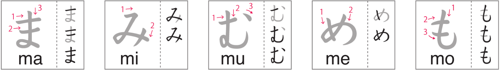

# Hiragana まみむめも

Day 17 - March 6, 2024

## 1 | Introduction どうにゅう

The seventh batch of hiragana which are **ま** _(ma)_, **み** _(mi)_, **む** _(mu)_, **め** _(me)_, and **も** _(mo)_.

## 2 | Hiragana まみむめも

Follow the strokes on the image below to learn the **m + vowels** hiragana.

(Image credit: NHK world)

## 3 | Vocabulary ごい

1. **金魚**

- Kana: _**きんぎょ**_
- Progressive: _**きngyo**_
- English: _**goldfish**_

2. **亀**

- Kana: _**かめ**_
- Progressive: _**かめ**_
- English: _**tortoise, turtle**_

3. **かえる**

- Kana: _**かえる**_
- Progressive: _**かえru**_
- English: _**frog**_

4. **豚**

- Kana: _**ぶた**_
- Progressive: _**ぶた**_
- English: _**pig**_

5. **はと**

- Kana: _**はと**_
- Progressive: _**はと**_
- English: _**pigeon, dove**_

6. **蟹**

- Kana: _**かに**_
- Progressive: _**かに**_
- English: _**crab**_

7. **蛇**

- Kana: _**へび**_
- Progressive: _**へび**_
- English: _**snake**_

8. **鳥**

- Kana: _**とり**_
- Progressive: _**とri**_
- English: _**bird**_

9. **ロブスター**

- Kana: _**ロブスター**_
- Progressive: _**robusuta-**_
- English: _**lobster**_

10. **とかげ**

- Kana: _**とかげ**_
- Progressive: _**とかげ**_
- English: _**lizard**_

11. **魚**

- Kana: _**さかな**_
- Progressive: _**さかな**_
- English: _**fish**_

12. **恐竜**

- Kana: _**きょうりゅう**_
- Progressive: _**kyoうryuう**_
- English: _**dinosaur**_

13. **鮪**

- Kana: _**まぐろ**_
- Progressive: _**まぐro**_
- English: _**tuna**_

14. **海老**

- Kana: _**えび**_
- Progressive: _**えび**_
- English: _**shrimp**_

15. **平目**

- Kana: _**ひらめ**_
- Progressive: _**ひraめ**_
- English: _**halibut**_

> halibut is a type of fish

16. **イカ**

- Kana: _**いか**_
- Progressive: _**いか**_
- English: _**squid**_

> I'm not sure why it's written in katakana and looking it up in the dictionary, it is written in katakana but there exists a kanji for it which is 鰞 and still pronounced いか.

## 4 | Words ことば

1. **もri**

- English: _**forest**_

2. **もみじ**

- English: _**maple leaf**_

3. **むri**

- English: _**impossible**_

4. **めだつ**

- English: _**to stand out**_

5. **みru**

- English: _**to see, to watch**_

6. **めがね**

- English: _**glasses**_

7. **たべもの**

- English: _**food**_

8. **まもru**

- English: _**to protect**_

9. **むしあつい**

- English: _**humid**_

10. **まほう**

- English: _**magic**_

11. **みみず**

- English: _**earthworm**_

12. **yoむ**

- English: _**to read**_

13. **しつもん**

- English: _**question**_

14. **なみだ**

- English: _**tears**_

15. **あめ**

- English: _**candy**_

16. **もも**

- English: _**peach**_

17. **むし**

- English: _**insect**_

18. **かみ**

- English: _**paper, hair**_

19. **だめ**

- English: _**no good**_

20. **みせ**

- English: _**store**_

21. **まじめ**

- English: _**serious**_

22. **むすこ**

- English: _**son**_

23. **むすめ**

- English: _**daughter**_

24. **ものさし**

- English: _**ruler**_

25. **みじかい**

- English: _**short**_

26. **もしもし**

- English: _**hello (on the phone)**_

27. **しも**

- English: _**frost**_

28. **むね**

- English: _**chest**_

29. **ひま**

- English: _**free time**_

30. **むずかしい**

- English: _**difficult**_

31. **もくじ**

- English: _**contents**_

32. **ななめ**

- English: _**diagonal**_

33. **まね**

- English: _**imitation**_
