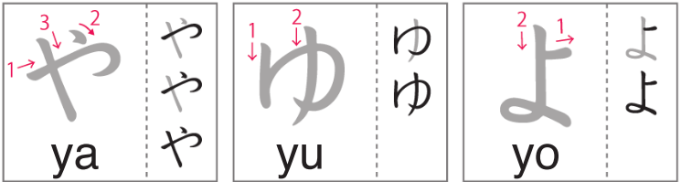
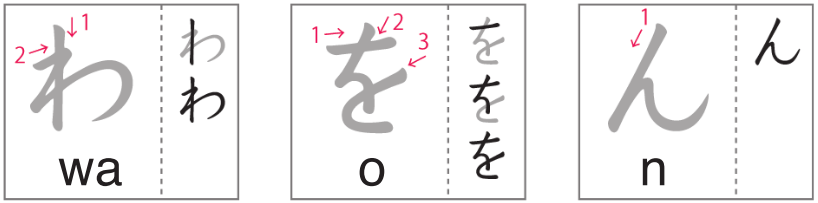

# Hiragana やゆよわをん

Day 19 - March 8, 2024

## 1 | Introduction どうにゅう

The eight batch of hiragana and actually the second last batch! Today we learn to write **や** _(ya)_, **ゆ** _(yu)_, **よ** _(yo)_, **わ** _(wa)_, **を** _(wo)_, and **ん** _(n)_.

## 2 | Hiragana やゆよ

Follow the strokes on the image below to learn the **y + vowels** hiragana.

(Image credit: NHK world)

## 3 | Hiragana わをん

Follow the strokes on the image below to learn the **w + vowels** and **n** hiragana.

(Image credit: NHK world)

## 4 | を particle

The **を** hiragana is only used as an **object marker particle**. Other than that, it's never used on any other purpose. It is read as **"o"**, however, the hiragana お can **never** replace を as a particle.

Examples

1. てがみ**を**(wo)かきます。 (I will write a letter.)
2. えんぴつ**を**(wo)ください。 (Give me a pencil please.)

## 5 | Vocabulary ごい

1. **卵**

- Kana: _**たまご**_
- Progressive: _**たまご**_
- English: _**egg**_

2. **ご飯**

- Kana: _**ごはん**_
- Progressive: _**ごはん**_
- English: _**boiled rice**_

3. **ミルク**

- Kana: _**ミルク**_
- Progressive: _**miruku**_
- English: _**milk**_

4. **水**

- Kana: _**みず**_
- Progressive: _**みず**_
- English: _**water**_

5. **ジュース**

- Kana: _**ジュース**_
- Progressive: _**ju-su**_
- English: _**juice**_

6. **栗**

- Kana: _**くり**_
- Progressive: _**くり**_
- English: _**chestnut**_

7. **パン**

- Kana: _**パン**_
- Progressive: _**pan**_
- English: _**bread**_

8. **ケーキ**

- Kana: _**ケーキ**_
- Progressive: _**keeki**_
- English: _**cake**_

9. **アイスクリーム**

- Kana: _**アイスクリーム**_
- Progressive: _**aisu kuri-mu**_
- English: _**ice cream**_

10. **人参**

- Kana: _**にんじん**_
- Progressive: _**にんじん**_
- English: _**carrot**_

11. **トマト**

- Kana: _**トマト**_
- Progressive: _**tomato**_
- English: _**tomato**_

12. **大根**

- Kana: _**だいこん**_
- Progressive: _**だいこん**_
- English: _**radish**_

13. **玉ねぎ**

- Kana: _**たまねぎ**_
- Progressive: _**たまねぎ**_
- English: _**onion**_

14. **こしょう**

- Kana: _**こしょう**_
- Progressive: _**こshoう**_
- English: _**pepper**_

15. **塩**

- Kana: _**しお**_
- Progressive: _**しお**_
- English: _**salt**_

16. **海老**

- Kana: _**えび**_
- Progressive: _**えび**_
- English: _**shrimp**_

17. **肉**

- Kana: _**にく**_
- Progressive: _**にく**_
- English: _**meat**_

18. **ポテト**

- Kana: _**ポテト**_
- Progressive: _**poteto**_
- English: _**potato**_

## 6 | Phrases かいわ

1. **どうしょう。**

- Kana: _**どうしょう。**_
- Progressive: _**どうしょう。**_
- English: _**What shall I do?**_

2. **本当ですか。**

- Kana: _**ほんとうですか。**_
- Progressive: _**ほんとうですか。**_
- English: _**Really?**_

## 7 | Words ことば

1. **わraう**

- English: _**to laugh**_

2. **わruい**

- English: _**bad**_

3. **こんや**

- English: _**tonight, this evening**_

4. **わすreru**

- English: _**to forget**_

5. **きんぞく**

- English: _**metal**_

6. **かんたん**

- English: _**easy**_

7. **たべru**

- English: _**to eat**_

8. **わに**

- English: _**alligator**_

9. **やね**

- English: _**roof**_

10. **ゆうべ**

- English: _**last night**_

11. **わかめ**

- English: _**seaweed**_

12. **うわさ**

- English: _**rumor**_

13. **ゆびわ**

- English: _**ring**_

14. **たいよう**

- English: _**the sun**_

15. **うわぎ**

- English: _**jacket**_

16. **ゆかた**

- English: _**light kimono**_

17. **ゆみや**

- English: _**bow and arrow**_

18. **かわかす**

- English: _**to dry**_

19. **たんさん**

- English: _**carbonation**_

20. **ゆうえんち**

- English: _**fun park**_

21. **ようちえん**

- English: _**kindergarten**_

22. **およめさん**

- English: _**bride**_

23. **しわ**

- English: _**wrinkles**_

24. **きんようび**

- English: _**Friday**_

25. **いし**

- English: _**rock**_

26. **てがみ**

- English: _**letter**_
