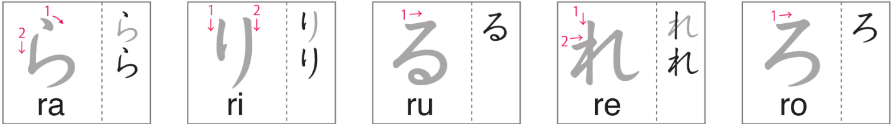

# Hiragana らりるれろ

Day 21 - March 10, 2024

## 1 | Introduction どうにゅう

The ninth and last batch of **new** hiragana!! The next hiragana lesson will be the final one. And this batch consists of **ら** _(ra)_, **り** _(ri)_, **る** _(ru)_, **れ** _(re)_, and **ろ** _(ro)_.

## 2 | Hiragana らりるれろ

Follow the strokes on the image below to learn the **r + vowels** hiragana.

(Image credit: NHK world)

## 3 | Vocabulary ごい

1. **山**

- Kana: _**やま**_
- Progressive: _**やま**_
- English: _**ｍountain**_

2. **雨**

- Kana: _**あめ**_
- Progressive: _**あめ**_
- English: _**rain**_

3. **太陽**

- Kana: _**たいよう**_
- Progressive: _**たいよう**_
- English: _**sun**_

4. **月**

- Kana: _**つき**_
- Progressive: _**つき**_
- English: _**moon**_

5. **雪**

- Kana: _**ゆき**_
- Progressive: _**ゆき**_
- English: _**snow**_

6. **春**

- Kana: _**はる**_
- Progressive: _**はる**_
- English: _**spring**_

7. **夏**

- Kana: _**なつ**_
- Progressive: _**なつ**_
- English: _**summer**_

8. **秋**

- Kana: _**あき**_
- Progressive: _**あき**_
- English: _**autumn, fall**_

9. **冬**

- Kana: _**ふゆ**_
- Progressive: _**ふゆ**_
- English: _**winter**_

## 4 | Phrases かいわ

1. **本当？**

- Kana: _**ほんとう？**_
- Progressive: _**ほんとう？**_
- English: _**is that true? / really?**_

2. **私も**

- Kana: _**わたしも**_
- Progressive: _**わたしも**_
- English: _**Me too.**_

## 5 | Words ことば

1. **あたらしい**

- English: _**new**_

2. **しる**

- English: _**to know**_

3. **れんあい**

- English: _**true love**_

4. **みせる**

- English: _**to show**_

5. **れんshuう**

- English: _**practice**_

6. **べんり**

- English: _**convenient**_

7. **うるおい**

- English: _**moisture**_

8. **かくれんぽ**

- English: _**hide and seek**_

9. **どうろ**

- English: _**road**_

10. **るうか**

- English: _**hallway**_

11. **まわりみち**

- English: _**detour**_

12. **いくら**

- English: _**salted salmon eggs**_

13. **くすり**

- English: _**medicine**_

14. **ろうそく**

- English: _**candle**_

15. **かれい**

- English: _**flounder**_

16. **りか**

- English: _**science**_

17. **よる**

- English: _**night**_

18. **れい**

- English: _**example**_

19. **まる**

- English: _**circle**_

20. **あひる**

- English: _**duck**_

21. **ひだり**

- English: _**left**_

22. **らんぼう**

- English: _**violence**_

23. **こんらん**

- English: _**confusion**_

24. **あらし**

- English: _**a storm**_

25. **れんらく**

- English: _**contact**_

26. **どろぼう**

- English: _**a thief**_

27. **どんぐり**

- English: _**acorn**_

28. **ろうじん**

- English: _**old person**_

29. **らくがき**

- English: _**graffiti**_

30. **りゆう**

- English: _**a reason**_

31. **かいろ**

- English: _**heat pad**_

32. **わすれもの**

- English: _**forgotten item**_

33. **めじるし**

- English: _**landmark**_

34. **めずらしい**

- English: _**rare (adjective)**_
