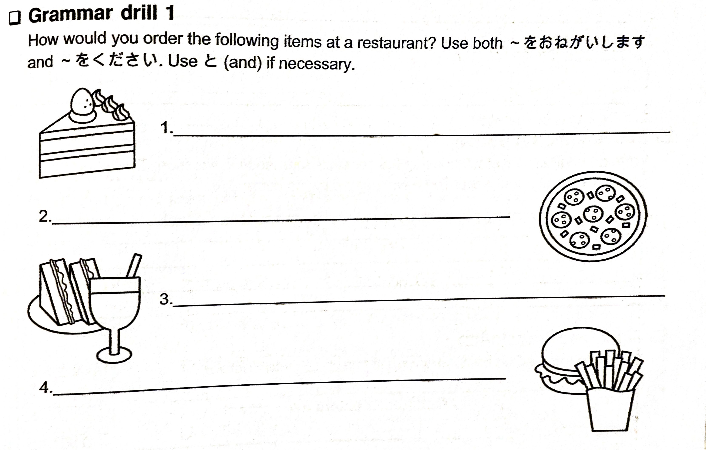

# Lesson 10 Exercises (Asking for Things)

## 0 | Reading Comprehension

Read the sentences below. You will need them when answering the reading comprehension questions later.

1. **Conversation takes place in a restaurant in Japan**

- **Waitress**: いらっしゃいませ！
- **Customer**: Menyuー を おねがいします。

5 minutes later...

- **Customer**: すみません。
- **Waitress**: はい。
- **Customer**: Supagettiー を ください。
- **Waitress**: おのみもの は なに が いいですか。
- **Customer**: みず を ください。
- **Waitress**: はい、しょうしょう おまちください。

10 minutes later...

- **Waitress**: はい、どうぞ。
- **Customer**: ありがとう。おちゃ と koーra を ください。
- **Waitress**: はい、しょうしょう おまちください。

40 minutes later...

- **Customer**: いくらですか。
- **Waitress**: にせん ごひゃく にじゅう いち えんです。
- **Customer**: はい。
- **Waitress**: おつり は よんひゃく ななじゅう きゅう えんです。ありがとうございました。

## 1 | Word practice

Replace the words inside the parenthesis to their corresponding hiragana.

1. とう(cha)く [arrival]
2. さん(bya)く [three hundred]
3. と(sho)かん [library]
4. (gyu)う(nyu)う [cow's milk]
5. さん(mya)く [mountain range]
6. (sho)うばい [business, commerce]
7. (ju)うたん [carpet]
8. でん(pyo)う [sales slip, voucher]
9. (kyo)うだい [siblings]
10. (kyo)う(ryu)う [dinosaur]
11. (ryu)うがく [study abroad]
12. (gyu)うどん [beef bowl]

## 2 | Writing practice

Write the following words 3-5 times.

1. ちょう (butterfly)
2. きゅう (nine)
3. びょうき (sick)
4. じゅう (ten)
5. りゅう (dragon)
6. ぎゃく (reverse)
7. みょうじ (last name)
8. しゅうり (repair)
9. きょく (a song)
10. きょうと (Kyoto)
11. りょこう (travel)
12. かいしゃ (company)
13. でんしゃ (train)
14. きんぎょ (gold fish)
15. ちゃわん (bowl)

## 3 | Question and answer

### 3.1 | Question and answer 1

Do the following exercise in the image below.

### 3.2 | Question and answer 2

Answer the following questions in Japanese. Then add a second sentence using the も particle **or** でも as shown in the examples.

**Example: いぬ が すきですか。**

- はい、いぬ が すきです。ねこ も すきです。
- いいえ、いぬ が きらいです。ねこ も きらいです。
- いいえ、いぬ が きらいです。でも、ねこ は すきです。

1. あたらしい terebi が ほしいですか。
2. はる が すきですか。
3. Koーra は、おいしい ですか。
4. あなた の くるま は、おおきい ですか。

## 4 | Japanese translation 1

Translate the reading comprehension in this lesson into English.

## 5 | Japanese translation 2

Translate the short dialogue below.

1.

- **Waitress**: いらっしゃいませ。Menyuー を どうぞ。
- **さゆり**: ここ は てんぷら が おいしい です。
- **ちえこ**: そうですか。じゃあ、てんぷら が いいです。
- **さゆり**: わたし も てんぷら が すきです。でも、きょう は とんかつ が いいです。
- **ちえこ**: じゃあ、てんぷら と とんかつ を おねがいします。
- **Waitress**: かしこまりました。おのみもの は なに が よろしいですか。
- **さゆり**: Aisu tiー を ください。
- **ちえこ**: わたし は おちゃ を おねがいします。
- **Waitress**: かしこまりました。

## 6 | Knowledge check

Translate the following sentences in English. You don't have to write them. If you're unsure what they mean then review the lesson before moving forward.

1. Supagettiー を ください。
2. Menyuー を おねがいします。みず も おねがいします。
3. なに が いいですか。
