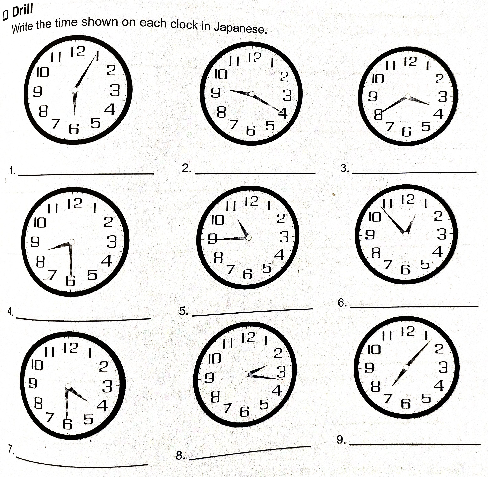

# Lesson 13 Exercises (Telling Time)

## 0 | Reading Comprehension

Read the sentences below. You will need them when answering the reading comprehension questions later.

1. ここ に にほんご の がっこう です。
2. ここ に Samuさん は ごぜん じゅうじ に いきました。
3. Jonさん は じゅうじ じゅうごふん に いきました。
4. きょう の じゅぎょう は じゅうじはん から ごご いちじ まで です。
5. Samuさん は にじ に いえ に かえります。
6. ごご よじ に しごと に いきます。
7. Samuさん の しごと は よじはん から ごぜん いちじはん まで です。
8. Samuさん の しごと は hoteru の しごと です。
9. Jonさん は にじはん に supeinご の がっこう に いきます。
10. Supeinご の がっこう は さんじ まで です。
11. いえ に ろくじ に かえるます。
12. ごご はちじ から arubaito です。
13. しちじ ごじゅうごふん に いきます。
14. Arubaito は じゅうにじ まで です。
15. Jonさん の arubaito は ｍakudonarudo です。

## 1 | Drill

Do the exercise in the image below.

## 2 | Question and answer

Answer the following questions in hiragana you've learned as if they're being asked to you. If the question is not applicable to you, invent an answer.

1. しごと/がっこう は なんじ から ですか。
2. なんじ に しごと/がっこう に いきますか。
3. なんようび に しごと/がっこう に いきますか。
4. なんじ に いえ に かえりますか。
5. いま、なんじ ですか。
6. にほんご の じゅぎょう は なんじ から なんじ まで ですか。
7. あなた の にほんご の せんせい は だれ ですか。
8. ふゆ は なんがつ から なんがつ まで ですか。 (December to February)
9. なつ は なんがつ から なんがつ まで ですか。 (June to September)

## 3 | Reading comprehension questions

Answer the following questions using the hiragana you know (except katakana of course).

1. ここ は どこ ですか。
2. だれ が にほんご の がっこう に じゅうじ に きましたか。
3. きょう の じゅぎょう は いつ ですか。
4. Samuさん の しごと は なんじ から なんじ まで ですか。
5. Samuさん は いえ に なんじ に かえりましたか。
6. Jonさん の arubaito は なんじ から なんじ まで ですか。
7. Jonさん は なんじ に にほんご の がっこう に きましたか。
8. Jonさん は にじはん に どこ に いきますか。

## 4 | Japanese translation 1

Translate the following conversations in English.

1.

- **A**: いつ から しごと ですか。
- **B**: にがつ ようか から です。
- **A**: しごと は なんじ から なんじ まで ですか。
- **B**: ごぜん はちじ から ごご よじ まで です。

2.

- **A**: いま なんじ ですか。
- **B**: よじ にじゅっぷん です。
- **A**: よじはん に いえ に かえります。
- **B**: いえ は どこ ですか。
- **A**: あそこ です。

3.

- **A**: あした から にほん に かえります。
- **B**: いつ まで ですか。
- **A**: はちがつ じゅうごにち まで です。
- **B**: そうですか。いいですね。

## 5 | English translation

Translate the following sentences to Japanese.

1.

- **A**: When did you come here?
- **B**: I came at nine.
- **A**: Where is your friend?
- **B**: My friend didn't come.
- **A**: Where is your friend now?
- **B**: He is at home now.

2.

- **A**: What time is your airplane?
- **B**: It's 10:30 AM.
- **A**: What time are you going to the airport?
- **B**: I'll go at 9:00.
- **A**: Got it.

3.

- **A**: From what time is your part time job?
- **B**: It's from 1:00 PM.
- **A**: Do you like your part time job?
- **B**: No, I don't like it.

## 6 | Practice drill

Replace ・ with the appropriate particles.

1. わたし ・ しごと ・ はちじ ・ ごじ ・ です。
2. せんげつ ・ じゅうごにち ・ もくようび でした。
3. なんじ ・ いえ ・ かえります ・ ？
4. やまださん ・ くるま ・ しろ ・ gure-です。
5. いぬ ・ すきです。でも、ねこ ・ きらいです。
6. あたらしい じてんしゃ ・ ほしいです。
7. どれ ・ たなかさん ・ ほんです？
8. かようび ・ とうきょう ・ いきます。
9. Hanba-ga- ・ poteto ・ おねがいします。
10. Ko-ra ・ (also) おねがいします。

## 7 | Japanese translation 2

Translate the following short dialogue to English.

1. Hashimoto is talking to Watanabe about his plans for the weekend.

- **わたなべさん**: はしもとさん、あした も はちじ から しごと ですか。
- **はしもとさん**: いいえ、あした は やすみ です。
- **わたなべさん**: いいですね。あした は どこ に いきますか。
- **はしもとさん**: あした は おおさか に いきます。
- **わたなべさん**: ひこうき ですか。
- **はしもとさん**: はい。くじ の ひこうき です。くうこう に はちじ に いきます。
- **わたなべさん**: そうですか。いつ かえりますか。
- **はしもとさん**: らいしゅう の かようび に とうきょう に かえります。

## 8 | Knowledge check

Translate the following sentences in English. You don't have to write them. If you're unsure what they mean then review the lesson before moving forward (which is book 2 yay!!).

1. なんじ に いきますか。
2. でんしゃ は なんじ ですか。
3. がっこう は いちじ から はちじ まで です。
4. あなた の しごと は なんじ から ですか。
5. ごぜん ろくじ に くうこう に いきます。
