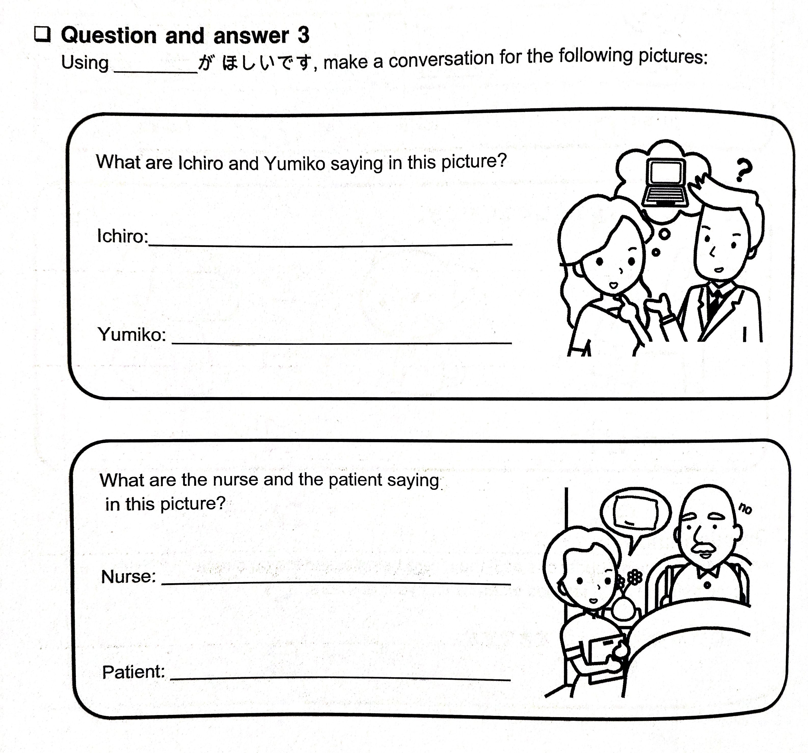
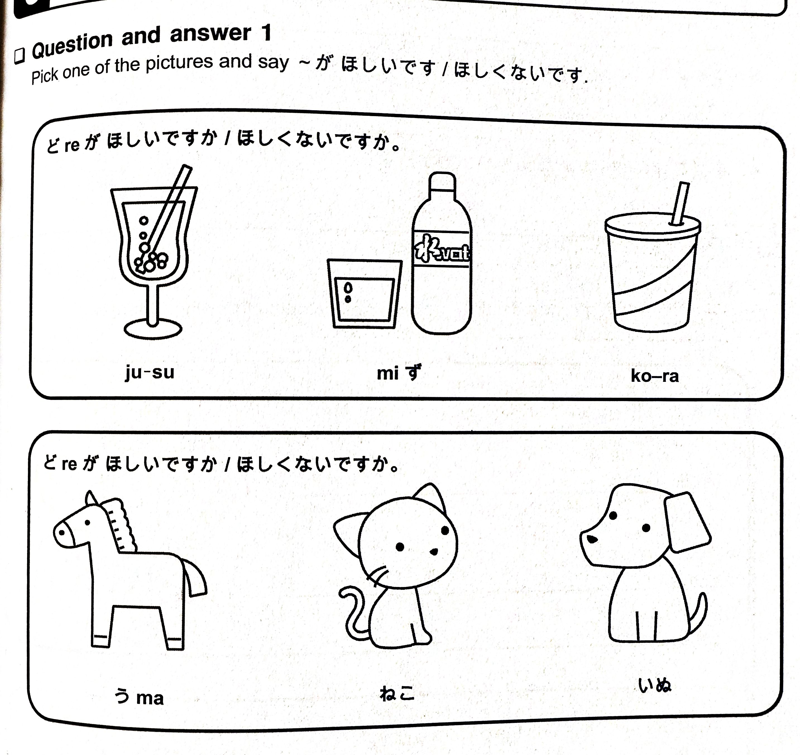

# Lesson 6 Exercises (Wanting and Not Wanting)

## 0 | Reading Comprehension

Read the sentences below. You will need them when answering the reading comprehension questions later.

1. Boく の なmaえ wa maつmoとです。
2. Inta-netto が すきです。
3. Konpyu-ta- が hoしいです。
4. Boく の とmoだち の たしroくn wa konpyu-ta- が hoしくないです。
5. たしroくn wa あかいくruma が hoしいです。
6. Boく wa あかいくruma ga すきjaないです。
7. しroいくruma が すきです。

## 1 | Word practice

Replace the words inside the parenthesis to their corresponding hiragana.

1. (ha)ru [spring]
2. (hi)ruご(ha)n [lunch]
3. (fu)yu [winter]
4. (he)いwa [peace]
5. え(ho)n [picture book]
6. がn(ba)ru [to do your best]
7. (ha)な(bi) [fireworks]
8. かmi(bu)くro [paper bag]
9. (hi)とme(bo)re [love at first sight]
10. くra(be)ru [to compare]
11. (hi)(ba)な [electric spark]
12. えn(pi)つ [pencil]

## 2 | Writing practice

Write the following words 3-5 times.

1. はし (chopsticks)
2. へそ (belly button)
3. はと (pigeon, dove)
4. ぶた (pig)
5. ひと (people)
6. しっぽ (tail)
7. とうふ (tofu)
8. はっぱ (leaf)
9. ほっぺ (cheeks)
10. ぼうし (hat)
11. きっぷ (ticket)
12. はなび (fireworks)

## 3 | Question and answer

### 3.1 | Test 1

Do what is asked in the image below. It wasn't stated but write down your answer.

### 3.2 | Test 2

Answer the following questions while using the hiragana you've learned.

1. なにいro の くruma が すきですか。
2. にほn の ざっし が ほしいですか。
3. つmeたいko-ra が ほしいですか。
4. あなたのterebi は あたraしいですか。

### 3.3 | Test 3

Do what is asked in the image below.

## 4 | English translation

Translate the following dialogues to Japanese.

1.

- **Georgeさn**: _"What is your name?"_
- **Yuかriさn**: _"It is Yukari. What is yours?"_
- **Georgeさn**: _"My name is George. I am 34 years old. How old are you?"_
- **Yuかriさn**: _"I am 26 years old."_

## 5 | Reading comprehension questions

Answer the following questions regarding this lesson's reading comprehension.

1. Maつmoとくnは、なにがすきですか。
2. Maつmoとくnのとmoだちのなmaえは、なnですか。
3. たしroくnは、なにがほしいですか。
4. Maつmoとくnは、あかいくrumaがすきですか。
5. Maつmoとくnは、なにいroのくrumaがすきですか。

## 6 | Writing practice 2

Write the following words **5 times**.

1. しばふ (grass)
2. ふうふ (married couple)
3. はこぶ (to move an item)
4. へいたい (soldier)
5. すなば (sand box)
6. こうべ (Kobe city)
7. ばくはつ (explosion)
8. てっぽう (gun)
9. ぴかぴか (shiny)

## 7 | Knowledge check

Translate the following sentences in English. You don't have to write them. If you're unsure what they mean then review the lesson before moving forward.

1. なにがほしいですか。
2. つmeたいmiずがほしいです。
3. あかくないrinごwaすきjaないです。
