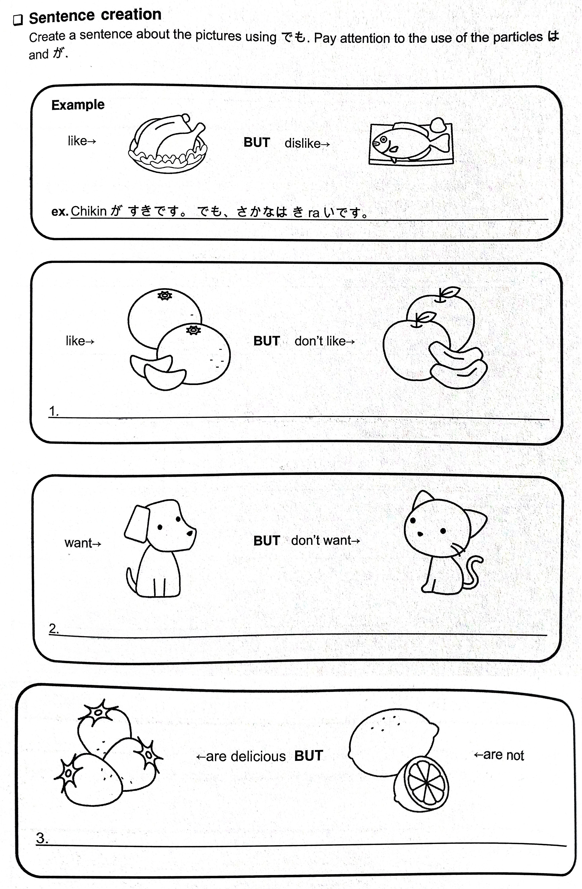

# Lesson 7 Exercises (Locations)

## 1 | Word practice

Read the sentences below. You will need them when answering the reading comprehension questions later.

1. (mo)ri [forest]
2. (mo)(mi)じ [maple leaf]
3. (mu)ri [impossible]
4. (me)だつ [to stand out]
5. (mi)ru [to see, to watch]
6. (me)がね [eye glasses]
7. たべ(mo)の [food]
8. (ma)(mo)ru [to protect]
9. の(mi)(mo)の [a drink]
10. (mu)しあつい [humid]
11. (ma)ほう [magic]
12. (mi)(mi)ず [earthworm]

## 2 | Writing practice

Write the following words 3-5 times.

1. まど (window)
2. もも (peach)
3. むし (insect)
4. かみ (paper, hair)
5. だめ (no good)
6. みせ (store)
7. あたま (head)
8. まじめ (serious)
9. さしみ (sashimi)
10. むすこ (son)
11. むすめ (daughter)
12. ものさし (ruler)
13. みじかい (short)

## 3 | Build sentences

Do what is asked in the image below.

## 4 | What would you say?

What would you say in the following situations?

1. おいしいresutoranはどこですか。
2. あなたのいえは、どこですか。
3. にほnのくruまがほしいですか。
4. みどriのrinごがすきですか。
5. あなたのterebiはあたraしいですか。
6. あなたのじてnshaは、なにいroですか。
7. つめたいみずがほしいですか。

## 5 | Knowledge check

Translate the following sentences in English. You don't have to write them. If you're unsure what they mean then review the lesson before moving forward.

1. あなたのいえはどこですか。
2. Waたしはでnshaがすきです。でも、ひこうきはだいきraいです。
