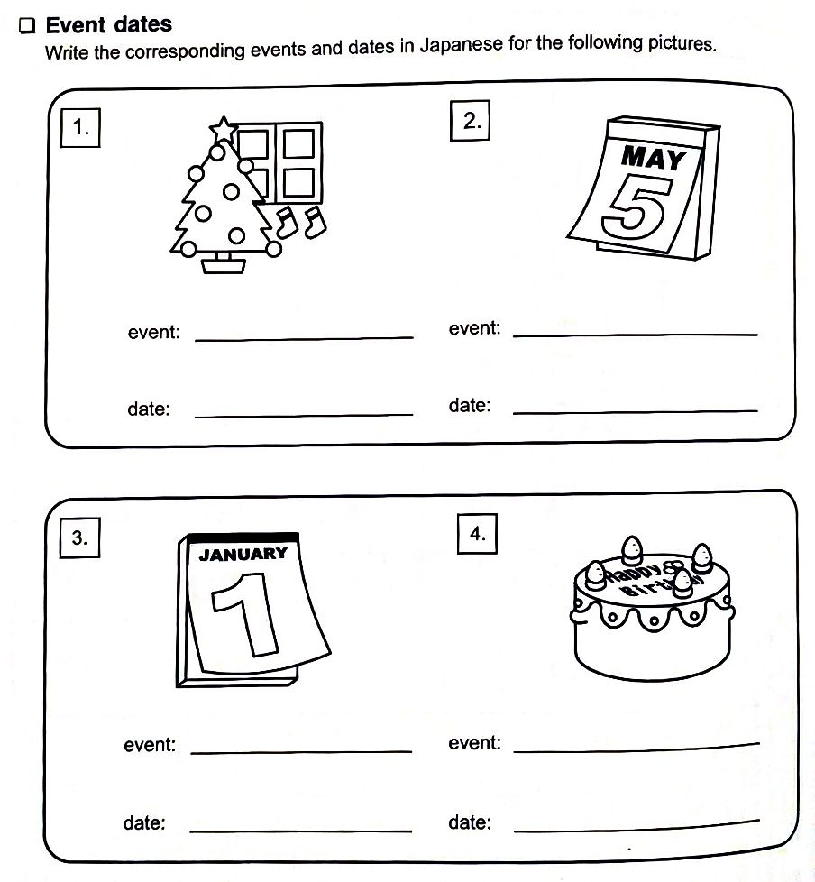

# Lesson 9 Exercises (Days, Weeks, and Years)

## 0 | Reading Comprehension

Read the sentences below. You will need them when answering the reading comprehension questions later.

1. Kyoう は juうにがつ さんjuうにち です。
2. あさって は がんたん です。
3. ことし の がんたん は もくようび です。
4. Kyoねん の がんたん は すいようび でした。

## 1 | Word practice

Replace the words inside the parenthesis to their corresponding hiragana.

1. あた(ra)しい [new]
2. し(ru) [to know]
3. (re)んあい [true love]
4. (ri)んご [apple]
5. みせ(ru) [to show]
6. (re)んshuう [practice]
7. べん(ri) [convenient]
8. う(ru)おい [moisture]
9. かく(re)んぽ [hide and seek]
10. どう(ro) [road]
11. (ro)うか [hallway]
12. まわ(ri)みち [detour]

## 2 | Writing practice

Write the following words 3-5 times.

1. りか [science]
2. よる [night]
3. れい [example]
4. まる [circle]
5. こおり [ice]
6. あひる [duck]
7. かえる [frog]
8. りんご [apple]
9. べんり [convenient]
10. ひだり [left]
11. みずいろ [light blue]
12. きいろ [yellow]
13. ろうそく [candle]
14. さる [monkey]

## 3 | Event dates

Do the following exercise in the image below.

## 4 | Question and answer

Answer the following questions while using the hiragana you've learned.

1. あさって は なんようび ですか。
2. あととい は なんがつ なんにち でしたか。
3. たんjoうび は、なんがつ なんにち ですか。
4. Kyoねん は なんねん でしたか。
5. せんげつ の ついたち は なんようび でしたか。
6. らいshuう の もくようび は なんにち ですか。
7. せんshuう の どようび は なんにちでしたか。
8. らいねん は、なんねん ですか。

## 5 | Japanese translation 1

Translate the reading comprehension in this lesson into English.

## 6 | Japanese translation 2

Translate the short dialogue below.

1.

- **ようこ**: こんshuう の きんようび は わたし の たんjoうび です。
- **たかひろ**: そうですか。たんjoうびおめでとう。
- **ようこ**: ありがとう。
- **たかひろ**: なんねん うまれ ですか。
- **ようこ**: せん kyuうhyaく ななjuう さん ねん うまれ です。
- **たかひろ**: わたし も です。わたし の たんjoうび は せん kyuうhyaく ななjuう さん ねん の ろくがつ みっか です。
- **ようこ**: ほんとう？
- **たかひろ**: たんjoうびpa-ti- は、いつ ですか。
- **ようこ**: こんshuう の どようび です。

## 7 | Knowledge check

Translate the following sentences in English. You don't have to write them. If you're unsure what they mean then review the lesson before moving forward.

1. Kyoう は なんようび ですか。
2. きんようび は なんにち ですか。
3. らいshuう の にちようび は わたし の ともだち の たんjoうび です。
4. きょねん の にがつ は さむかって でしたか。

> For some unknown reason, the 4th sentence uses さむかって which means "cold" with its some sort of adjective conjugated form. I'd say ignore it but I included it there because why not.
