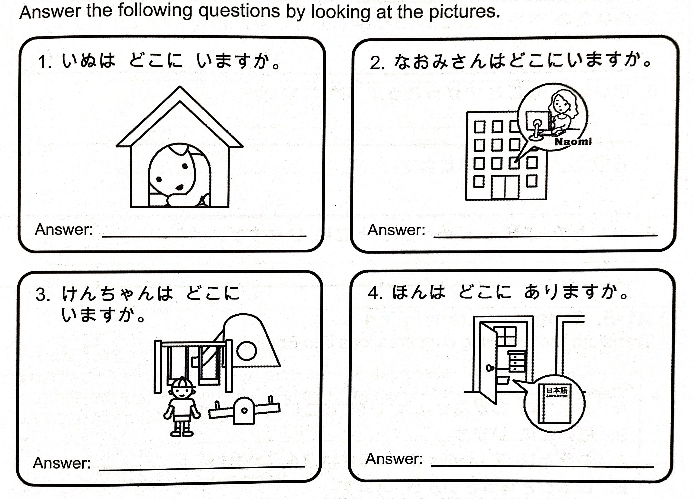

# Lesson 1 Exercises

March 27, 2024

## 1.1 | Word practice ことば の れんしゅう

Replace the following roma-ji in katakana.

1. (e)rebe-ta-
2. (a)nime
3. (e)(a)kon
4. (o)renji
5. (a)ba(u)to
6. (i)nku
7. (i)tari(a)n
8. (o)muretsu
9. (o)-pun
10. (u)(i)nka-
11. (a)-mondo
12. (u)ran

## 1.2 | Words you can write かける ことば

Write the following words 5 times.

1. イー
2. エー
3. オー
4. ウイ
5. エアー

## 1.3 | Verb forms

Write down the following conjugation for the following verbs.

1. ある

- Polite form, present/future positive
- Polite form, present/future negative
- Polite form, past positive
- Polite form, past negative

1. いる

- Polite form, present/future positive
- Polite form, present/future negative
- Polite form, past positive
- Polite form, past negative

## 1.4 | Verb choice and translation

Add either あります or います then translate the sentence into English.

1. あそこ に おおきい ねこ が _________。
2. たなかさん の うち に piアno が _________。
3. わたし は にちようび に いつも いえ に _________。
4. にほんご の kurasu は まいしゅう げつようび と すいようび に _________。
5. れいぞうこ に りんご が いつつ _________。

## 1.5 | Question and answer 1

Do the following exercise in the image.

## 1.6 | Question and answer 2

Answer the following questions. Invent answers if not applicable to you.

1. いつも だれ と こうえん に いきますか。
2. ときどき ともだち と うち に かえりますか。
3. うち に いぬ が いますか。
4. うち に ねこ が いますか。
5. あなた の へや に なに が ありますか。
6. まいにち しごと/がっこう が ありますか。
7. きのう どこ に いましたか。
8. あした の ごぜん じゅうじ に どこ に いますか。

## 1.7 | Japanese translation

Translate the following conversations into English.

1.

- A: あなた の おかあさん は いま どこ に いますか。
- B: にほん に います。
- A: あなた は アmerika に なんさい から いますか。
- B: じゅうきゅう さい から います。

2.

- A: あなた の へや に terebi が ありますか。
- B: はい、あります。
- A: でんわ は？
- B: でんわ は ありました。でも、いま は ありません。
- A: Konpyu-ta- も ありますか。
- B: いいえ、konpyu-ta- は ありません。

## 1.8 | English translation

Translate the following conversations into Japanese **and write where do you think the conversation taking place.** (Write it anywhere you want like after the exercise number.)

1.

- A: Do you have any apples?
- B: Yes, I have some.
- A: How many do you have?
- B: I have ten.

2.

- A: Where is the police station?
- B: It's over there. Do you know what I mean? (Do you understand?)
- A: I don't understand. Where is it?
- B: It's in the park.
- A: I see. Thank you!
- B: You're welcome.

## 1.9 | Reading Comprehension どっかい

### 1.9.1 | Reading comprehension

Read the following sentences for the upcoming questions for them.

1. ぼく の なまえ は はじめ です。
2. ぼく の いえ は とうきょう に あります。
3. うち に いぬ が います。
4. ねこ も います。
5. いぬ は なまえ が ありません。
6. いろ は しろ と ちょいろ です。
7. いぬ は いつも いぬごや に います。
8. いぬごや は そと に あります。
9. ねこ は そと に いきません。
10. なまえ は たま です。
11. ときどき たまちゃん は ぼく の へや に います。
12. ぼく の へや に beddo が ふたつ あります。
13. ひとつ の beddo は たまちゃん の beddo です。
14. Sutereオ も あります。
15. Terebi は ありません。
16. まいしゅう にちようび に いぬ と ぼく は こうえん に いきます。
17. こうえん に ごぜん じゅういちじ から ごご いちじはん まだ います。
18. かいもの も いきます。
19. うち に さんじ に かえります。
20. たまちゃん は いつも いえ に います。

### 1.9.2 | Reading comprehension questions

Answer the following questions regarding the reading comprehension above.

1. はじめくん の いえ は どこ に ありますか。
2. はじめくん の いえ に なに が いますか。
3. はじめくん の いぬ は なに いろ ですか。
4. ねこ は いつも そと に いきますか。
5. いぬ は いつも いえ の なか に いますか。
6. いぬごや は どこ に ありますか。
7. たま は ときどき どこ に いますか。
8. はじめくん の へや に なに が ありますか。
9. はじめくん は いつ いぬ と こうえん に いきますか。
10. いぬ と ねこ の なまえ は なんですか。

## 1.10 | Dialogue translation

Translate the following dialogue into English.

1.

- Tom: らいげつ、にほん に いきます。
- こじまさん: いいですね。だれ と いきますか。
- Tom: ともだち の Jon と いきます。でも、Jon は にほん の たべもの が きらいです。にほん に makudonarudo が ありますか。
- こじまさん: はい、たくさん あります。にほん の makku は、てりやき ba-ga- が あります。つきみ ba-ga- も あります。
- Tom: そうですか。おちゃ は ありますか。ぼく は おちゃ が だいすきです。
- こじまさん: いいえ、おちゃ は ありません。でも、アイsuti- が あります。
- Tom: じゃあ、Jon と makku に いきます。
