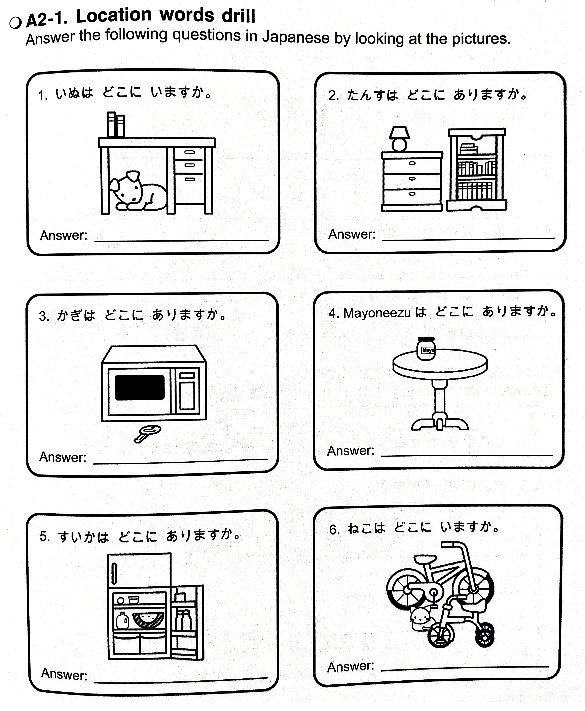
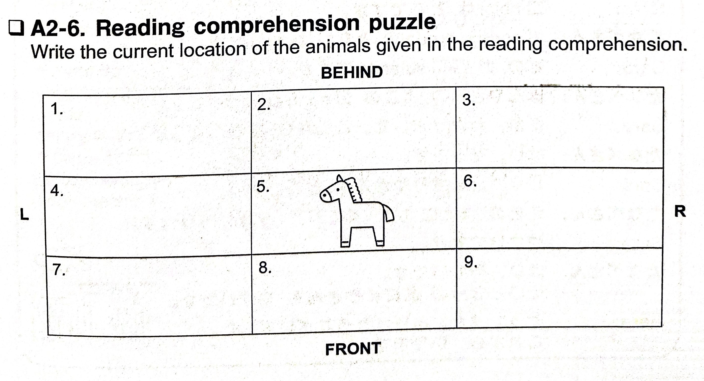

# Lesson 1 Exercises

April 4, 2024

## 2.1 | Word practice ことば の れんしゅう

Replace the following roma-ji in katakana.

1. (gu)ー(gu)ru [Google]
2. (ka)mera [camera]
3. アfuri(ka) [Africa]
4. (ko)ーhiー [coffee]
5. (ke)chappu [ketchup]
6. baイrin(ga)ru [bilingual]
7. (ku)reyon [crayon]
8. (ga)sorin [gasoline]
9. bi(ki)ni [bikini]
10. (gi)(ga)baイto [gigabyte]
11. イ(gi)risu [England]
12. (ko)ーn [corn]

## 2.2 | Words you can write かける ことば

Write the following words 5 times.

1. キー (key)
2. ギア (gear)
3. コア (core)
4. ギガ (giga)
5. ケーキ (cake)
6. コーク (coke)
7. ケアー (care)
8. ココア (cocoa)
9. カーゴ (cargo)
10. カーキ (khaki)
11. オーケー (OK)
12. キーキー (squeak)

## 2.3 | Location words drill

Do the following exercise below in the image.

## 2.4 | Question and answer

Answer the following questions as if they are asked directly to you. Invent an answer if not applicable.

1. あなた の つくえ の うえ に なに が ありますか。
2. あなた の うち の となり に なに が ありますか。
3. にほんご の ほん は どこ に ありますか。
4. ケchappu は どこ に ありますか。
5. Sofa- が どこ に ありますか。
6. あなた の へや の なか に なに が ありますか。

## 2.5 | Japanese translation

Translate the following conversations to English.

1.

- **A**: ここ から がっこう まで ぎんこう は いくつ ありますか。
- **B**: ひとつ です。
- **A**: どこ に ありますか。
- **B**: けいさつ の まえ に あります。

2.

- **A**: こばやしさん、やまださん は どこ に いますか。
- **B**: がっこう に いませんでしたか。
- **A**: いいえ、いませんでした。
- **B**: やまださん は がっこう の となり の こうえん に います。

3.

- **A**: せんせい、ぼく の あたらしい ほん は どこ ですか。
- **B**: いす の した に あります。
- **A**: それじゃない です。あかい ほん です。
- **B**: あかい ほん は よしだくん の つくえ の うえ に あります。

## 2.6 | English translation

Translate the following conversations into Japanese.

1.

- **A**: Where were you last Sunday?
- **B**: I was at my friend's house.
- **A**: From what time to what time were you there?
- **B**: From noon to seven.
- **A**: Where is your friend's house?
- **B**: It's next to a vegetable store.

2.

- **A**: Where are your keys?
- **B**: They are in my car.
- **A**: Where is your car?
- **B**: It's behind the house.

## 2.7 | Reading comprehension exercise

### 2.7.1 | Reading comprehension どっかい

Read the sentences below to answer the upcoming exercises for this reading comprehension.

1. わたし の がっこう の となり に どうぶつえん が あります。
2. なまえ は rasubeガsu どうぶつえん です。
3. Rasubeガsu どうぶつえん は とうきょう の にし に あります。
4. どうぶつえん に きりん と ひょう と カnガru- と とら が います。
5. かば と うし と うま と ぞう も います。
6. うし の となり に うま が います。
7. うま は きりん と かば の あいだ に います。
8. おととい まで うま の みぎよこ に うさぎ が いました。
9. きょう は いません。
10. きりん の みぎよこ に ぞう が います。
11. ひだり は うし の うしろ に います。
12. ひょう は うし の うしろ に います。
13. うし の まえ に とら が います。
14. とら の みぎよこ に かば が います。
15. かば は とら と カnガru- の あいだ に います。
16. カnガru- の うしろ に どうぶつ が いません。
17. あした ともだち と どうぶつえん に いきます。

### 2.7.2 | Reading comprehension puzzle

Do the following puzzle in the image below.

### 2.7.3 | Reading comprehension questions

Answer the following questions.

1. Rasubeガsu どうぶつえん は どこ に ありますか。
2. かば の みぎよこ に なに が いますか。
3. ぞう と カnガru- の あいだ に なに が いましたか。
4. うし は ひょう と とら の あいだ に いますか。
5. ぞう の ひだりよこ に なに が いますか。
6. うま の ひだりよこ に なに が いますか。

## 2.8 | Dialogue Japanese translation

Translate the following dialogue into English.

1.

- **Sara**: コnbini は どこ ですか。
- **たなべさん**: ガsorin sutando の となり に あります。
- **Sara**: どの ガsorin sutando ですか。
- **たなべさん**: ほんやさん の よこ の ガsorin sutando です。
- **Sara**: ああ、わかりました。ここ から ごふん ぐらい ですね。
- **たなべさん**: はい、そうです。
- **Sara**: じゃあ、くすりやさん は どこ ですか。
- **たなべさん**: えき の まえ に いい くすりやさん が あります。
- **Sara**: やすいですか。
- **たなべさん**: はい、やすいです。その となり の おにくやさん も やすいです。
- **Sara**: そうですか。ありがとうございました。これから、いきます。

Note: えき means _train station_.
