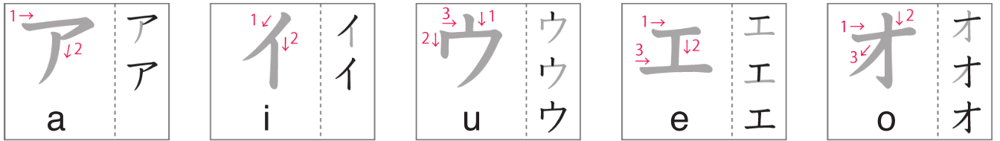

# Katakana アイウエオ

Day 31 (Book 2 Day 2) - March 27, 2024

## 1.0 | Introduction どうにゅう

Welcome to the first lesson of the katakana alphabet! In this lesson, we will learn how to write ア (a), イ (i), ウ (u), エ (e), and オ (o).

## 1.1 | Katakana アイウエオ

Follow the strokes below in the image to learn how to write the **vowels** katakana.

(Image credit: NHK world)

## 1.2 | Vocabulary

### 1.2.1 | Group C

1. **デパート**

- Progressive: _**depa-to**_
- English: _**department store**_

2. **専門店**

- Progressive: _**せんもんてん**_
- English: _**specialty store**_

3. **スーパー**

- Progressive: _**su-pa-**_
- English: _**supermarket**_

4. **薬屋**

- Progressive: _**くすりや**_
- English: _**drug store**_

5. **本屋**

- Progressive: _**ほんや**_
- English: _**book store**_

6. **コンビニ**

- Progressive: _**konbini**_
- English: _**convenience store**_

7. **八百屋**

- Progressive: _**やおや**_
- English: _**vegetable store**_

8. **肉屋**

- Progressive: _**(お)にくや**_
- English: _**butcher shop**_

9. **ガソリン・スタンド**

- Progressive: _**gasorin sutando**_
- English: _**gas station**_

10. **ドライブ・スルー**

- Progressive: _**doraイbu suru-**_
- English: _**drive-through**_

11. **持ち帰り**

- Progressive: _**もちかえり**_
- English: _**take out**_

12. **出前**

- Progressive: _**でまえ**_
- English: _**delivery (food)**_

13. **ファースト・フード**

- Progressive: _**fa-suto fu-do**_
- English: _**fast food**_

## 1.3 | Words

### 1.3.1 | Dialogue exercise's words

1. **沢山**

- Progressive: _**たくさん**_
- English: _**a lot, many**_

2. **照り焼きバーガー**

- Progressive: _**てりやき ba-ga-**_
- English: _**teriyaki-flavored hamburger**_

3. **月見バーガー**

- Progressive: _**つきみ ba-ga-**_
- English: _**hamburger with sunny-side up egg on it**_

4. **お茶**

- Progressive: _**おちゃ**_
- English: _**green tea**_

5. **アイスティー**

- Progressive: _**アイsuti-**_
- English: _**iced tea**_

## 1.3.2 | Lesson's exercises' words

1. **エレベーター**

- Progressive: _**エrebe-ta-**_
- English: _**elevator**_

2. **アニメ**

- Progressive: _**アnime**_
- English: _**anime**_

3. **エアコン**

- Progressive: _**エアkon**_
- English: _**air conditioner**_

4. **オレンジ**

- Progressive: _**オrenji**_
- English: _**orange**_

5. **アバウト**

- Progressive: _**アbaウto**_
- English: _**sloppy, approximate**_

6. **インク**

- Progressive: _**イnku**_
- English: _**ink**_

7. **イタリアン**

- Progressive: _**イtariアn**_
- English: _**Italian**_

8. **オムレツ**

- Progressive: _**オmuretsu**_
- English: _**omelet**_

9. **オープン**

- Progressive: _**オーpun**_
- English: _**open**_

10. **ウインカー**

- Progressive: _**ウイnkaー**_
- English: _**car turn signal**_

11. **アーモンド**

- Progressive: _**アーmondo**_
- English: _**almond**_

12. **ウラン**

- Progressive: _**ウran**_
- English: _**uranium**_

13. **イー**

- Progressive: _**イー**_
- English: _**letter E**_

14. **エー**

- Progressive: _**エー**_
- English: _**letter A**_

15. **オー**

- Progressive: _**オー**_
- English: _**letter O**_

16. **ウイ**

- Progressive: _**ウイ**_
- English: _**French for yes (oui)**_

17. **エアー**

- Progressive: _**エアー**_
- English: _**air**_
