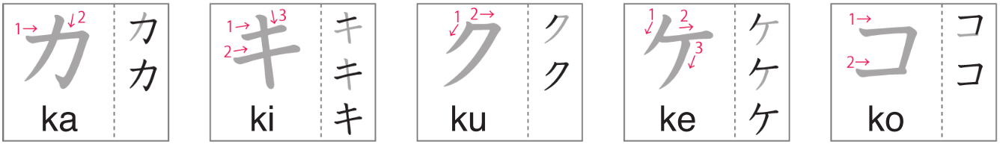
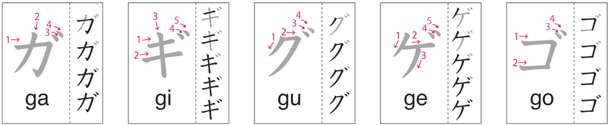

# Katakana カキクケコ・ガギグゲゴ

Day 33 (Book 2 Day 3) - April 4, 2024

## 2.0 | Introduction どうにゅう

Welcome to the second lesson of the katakana alphabet! In this lesson, we will learn how to write カ (ka), キ (ki), ク (ku), ケ (ke), コ (ko), ガ (ga), ギ (gi), グ (gu), ゲ (ge), and ゴ (go).

## 2.1 | Katakana カキクケコ

Follow the strokes below in the image to learn how to write the **K + vowels** katakana.

(Image credit: NHK world)

## 2.2 | Katakana ガギグゲゴ

Follow the strokes below in the image to learn how to write the **G + vowels** katakana.

(Image credit: NHK world)

## 2.3 | Vocabulary ごい

### 2.3.1 | Group D - Words Around the Office

1. **会社**

- Progressive: _**かいしゃ**_
- English: _**company**_

2. **ホッチキス**

- Progressive: _**hocchiキsu**_
- English: _**stapler**_

3. **定規**

- Progressive: _**じょうぎ**_
- English: _**ruler**_

4. **はさみ**

- Progressive: _**はさみ**_
- English: _**scissors**_

5. **プリンター**

- Progressive: _**purinta-**_
- English: _**printer**_

6. **消しゴム**

- Progressive: _**けしゴmu**_
- English: _**eraser**_

7. **会議**

- Progressive: _**かいぎ**_
- English: _**a meeting**_

8. **社長**

- Progressive: _**しゃちょう**_
- English: _**president (company)**_

9. **紙**

- Progressive: _**かみ**_
- English: _**paper**_

10. **給料**

- Progressive: _**きゅうりょう**_
- English: _**salary**_

11. **小切手**

- Progressive: _**こぎって**_
- English: _**a check (bank)**_

12. **ノートパソコン**

- Progressive: _**no-to pasoコn**_
- English: _**laptop computer**_

13. **コピー機**

- Progressive: _**kopi-き**_
- English: _**copy machine**_

## 2.4 | Words ことば

### 2.4.1 | Dialogue exercise's words

1. **どの～**

- Progressive: _**どの～**_
- English: _**which ~**_

2. **～位**

- Progressive: _**～ぐらい**_
- English: _**about ~**_

3. **これから**

- Progressive: _**これから**_
- English: _**right now, from now**_

### 2.4.2 | Lesson exercise's words

1. **カーten**

- English: _**curtain**_

2. **suキー**

- English: _**skiing**_

3. **taクshiー**

- English: _**taxi**_

4. **panケーキ**

- English: _**pancakes**_

5. **tabaコ**

- English: _**cigarettes, tabacco**_

6. **カrendaー**

- English: _**calendar**_

7. **グーグru**

- English: _**Google**_

8. **カmera**

- English: _**camera**_

9. **アfuriカ**

- English: _**Africa**_

10. **コーhiー**

- English: _**coffee**_

11. **ケchappu**

- English: _**ketchup**_

12. **baイrinガru**

- English: _**bilingual**_

13. **クreyon**

- English: _**crayon**_

14. **ガsorin**

- English: _**gasoline**_

15. **biキni**

- English: _**bikini**_

16. **ギガbaイto**

- English: _**gigabyte**_

17. **エギrisu**

- English: _**England**_

18. **コーn**

- English: _**corn**_

19. **キー**

- English: _**key**_

20. **ギア**

- English: _**gear**_

21. **コア**

- English: _**core**_

22. **ギガ**

- English: _**giga**_

23. **ケーキ**

- English: _**cake**_

24. **コーク**

- English: _**coke**_

25. **ケアー**

- English: _**care**_

26. **ココア**

- English: _**cocoa**_

27. **カーゴ**

- English: _**cargo**_

28. **カーキ**

- English: _**khaki**_

29. **オーケー**

- English: _**OK**_

30. **キーキー**

- English: _**squeak**_
